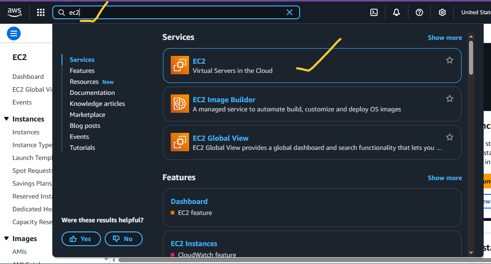

# LAMP Stack Implementation on AWS

## Overview
The **LAMP stack** is a web service solution stack consisting of:
- **L**inux – Operating system
- **A**pache – Web server
- **M**ySQL/MariaDB – Database
- **P**HP – Scripting language

We will deploy the LAMP stack on an Amazon EC2 instance running Ubuntu.

---

## 1. Prerequisites
Before starting, ensure you have:
1. An **AWS Account**.
2. Basic knowledge of **Linux commands**.
3. A **key pair** for SSH access.
4. AWS **security group rules** allowing:
   - HTTP (Port 80)
   - SSH (Port 22)
5. A local terminal (Linux/Mac/git bash) or **PuTTY** (Windows).

---

## 2. Step-by-Step Implementation

### Step 1: Launch an EC2 Instance
- Log into the AWS Management Console to setup the EC2 Instance.
---

---
- Search for **EC2  on the search bar**.
---

---
- Click on Launch Instance.
---

---
- Choose **Ubuntu Server 22.04 LTS** (or latest version).

- Select an **instance type** (e.g., t2.micro for free tier).
- Configure **Security Group** to allow HTTP, HTTPS, SSH.
- Launch and download the `.pem` key pair.

---

### Step 2: Connect to Your Instance
From your terminal:
```bash
chmod 400 my-key.pem
ssh -i my-key.pem ubuntu@<EC2_PUBLIC_IP>
```

---

### Step 3: Update the System
```bash
sudo apt update && sudo apt upgrade -y
```

---

### Step 4: Install Apache Web Server
```bash
sudo apt install apache2 -y
```
Enable and start Apache:
```bash
sudo systemctl enable apache2
sudo systemctl start apache2
```
Test: Visit `http://<EC2_PUBLIC_IP>` in your browser.

---

### Step 5: Install MySQL/MariaDB
```bash
sudo apt install mysql-server -y
```
Secure installation:
```bash
sudo mysql_secure_installation
```
Verify MySQL:
```bash
sudo systemctl status mysql
```

---

### Step 6: Install PHP
```bash
sudo apt install php libapache2-mod-php php-mysql -y
```
Check PHP version:
```bash
php -v
```

---

### Step 7: Test PHP Processing
Create a test file:
```bash
echo "<?php phpinfo(); ?>" | sudo tee /var/www/html/info.php
```
Visit:
```
http://<EC2_PUBLIC_IP>/info.php
```
If PHP info page appears, PHP is working.

---

### Step 8: Configure a Virtual Host (Optional but Recommended)
```bash
sudo mkdir /var/www/mywebsite
sudo chown -R $USER:$USER /var/www/mywebsite
sudo nano /etc/apache2/sites-available/mywebsite.conf
```
Add:
```apache
<VirtualHost *:80>
    ServerAdmin admin@mywebsite.com
    ServerName mywebsite.com
    ServerAlias www.mywebsite.com
    DocumentRoot /var/www/mywebsite
    ErrorLog ${APACHE_LOG_DIR}/error.log
    CustomLog ${APACHE_LOG_DIR}/access.log combined
</VirtualHost>
```
Enable site:
```bash
sudo a2ensite mywebsite.conf
sudo a2dissite 000-default.conf
sudo systemctl reload apache2
```

---

### Step 9: Firewall Configuration (If Using UFW)
```bash
sudo ufw allow OpenSSH
sudo ufw allow 'Apache Full'
sudo ufw enable
```

---

### Step 10: Testing MySQL with PHP
Create a PHP file:
```bash
sudo nano /var/www/html/db_test.php
```
Example code:
```php
<?php
$servername = "localhost";
$username = "root";
$password = "your_mysql_password";

// Create connection
$conn = new mysqli($servername, $username, $password);

// Check connection
if ($conn->connect_error) {
  die("Connection failed: " . $conn->connect_error);
}
echo "Connected successfully";
?>
```
Visit:
```
http://<EC2_PUBLIC_IP>/db_test.php
```

---

## 3. Troubleshooting
| Issue | Solution |
|-------|----------|
| Apache not starting | `sudo journalctl -xe` to check logs |
| PHP file downloads instead of executing | Ensure `libapache2-mod-php` is installed |
| MySQL access denied | Re-run `mysql_secure_installation` |
| Port 80 not reachable | Check AWS security group rules |
| UFW blocking traffic | Allow Apache in UFW |

---

## 4. Cleanup
If you no longer need the setup:
- Terminate the EC2 instance from AWS Console.
- Delete associated security groups and key pairs.

---

## 5. Architecture Diagram


---
**End of Guide**
