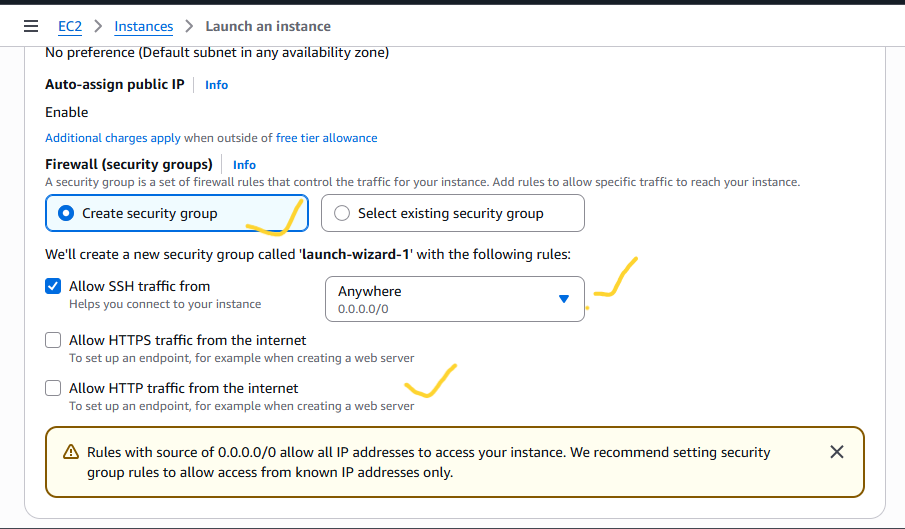
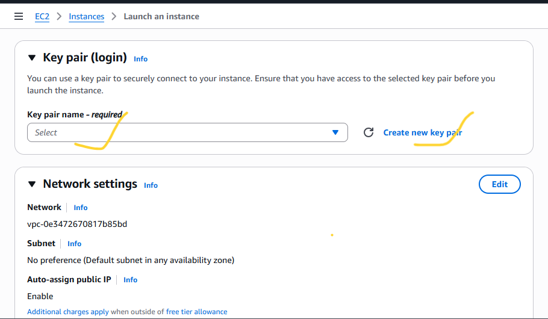
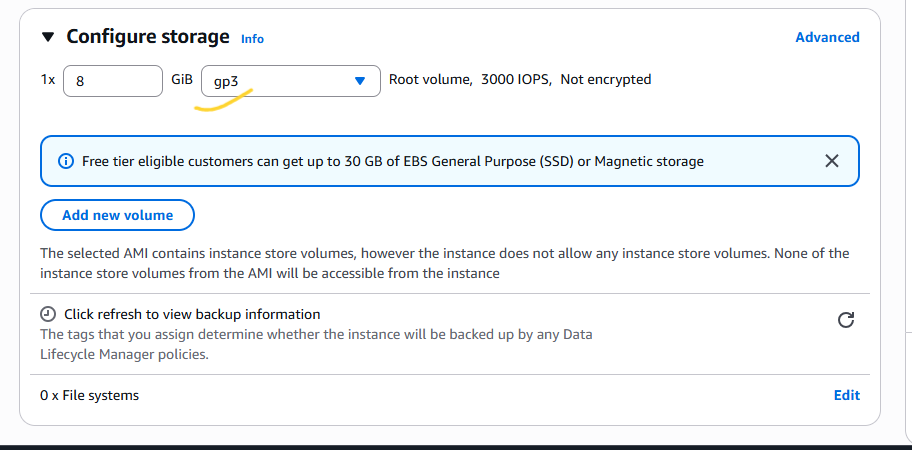
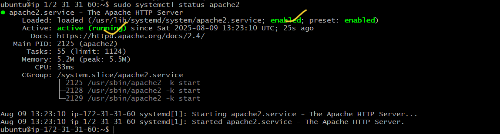
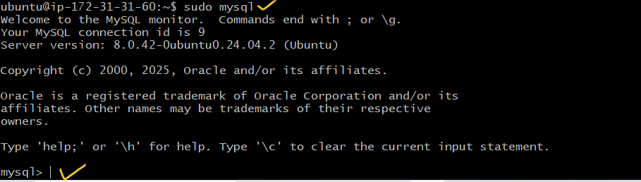

# LAMP Stack Implementation on AWS

## Overview
The **LAMP stack** is a web service solution stack consisting of:
- **L**inux – Operating system
- **A**pache – Web server
- **M**ySQL/MariaDB – Database
- **P**HP – Scripting language

We will deploy the LAMP stack on an Amazon EC2 instance running Ubuntu.

---

## 1. Prerequisites
Before starting, ensure you have:
1. An **AWS Account**.
2. Basic knowledge of **Linux commands**.
3. A **key pair** for SSH access.
4. AWS **security group rules** allowing:
   - HTTP (Port 80)
   - SSH (Port 22)
5. A local terminal (Linux/Mac/git bash) or **PuTTY** (Windows).

---

## 2. Step-by-Step Implementation

### Step 1: Launch an EC2 Instance
- Log into the AWS Management Console to setup the EC2 Instance.
---

---
- Search for **EC2  on the search bar**.
---

---
- Click on Launch Instance.
---

---
- Enter the name of your web server
---

---
- Choose **Ubuntu Server 22.04 LTS** (or latest version).
---

- Select an **instance type** (e.g., t2.micro for free tier).
---

- Configure **Security Group** to allow HTTP, HTTPS, SSH.
---

---
- Launch and download the `.pem` key pair or use an already created key pair.
---

---

---
- Configure the storage to what you prefer but we will leave everything default.
---

---
- Scroll down and at your right, click on Launch Instance.
---

---
- You should see this if everything is successful
---

---
- Make sure the status checks are all checked ensuring that our instance has been launched and running
---

---
- Now, copy the public IP Address of your instance
---

---
- Another way to retrieve your IP Address is to use this command
```bash
 TOKEN=`curl -X PUT "http://169.254.169.254/latest/api/token" -H "X-aws-ec2-metadata-token-ttl-seconds: 21600"` && curl -H "X-aws-ec2-metadata-token: $TOKEN" -s http://169.254.169.254/latest/meta-data/public-ipv4
```
### Step 2: Connect to Your Instance
From your terminal, cd Downloads/:
```bash
chmod 400 lamp-stack-kp.pem
ssh -i lamp-stack-kp.pem ubuntu@<EC2_PUBLIC_IP>
```
- Type `yes` 
---

---
- You're in when you see this
---

---

### Step 3: Update the System
```bash
sudo apt update && sudo apt upgrade -y
```

---

### Step 4: Install Apache Web Server
```bash
sudo apt install apache2 -y
```
Enable and start Apache:
```bash
sudo systemctl enable apache2
sudo systemctl start apache2
```
---
Check the status of Apache. If it's green, it means you did everything well
```bash
sudo systemctl status apache2
```
- You should see this if everything is well
---

---
- Test: Visit `http://<EC2_PUBLIC_IP>` in your browser.
---

---
- Test: You can also test in your terminal with these commands
```bash
curl http://localhost:80 
```
or
```bash
curl http://127.0.0.1:80
```
---

---

### Step 5: Installing MySQL
```bash
sudo apt install mysql-server -y
```
Verify MySQL:
```bash
sudo systemctl status mysql
```
---

---
Log into mysql by typing this command
```bash
sudo mysql
```
- You will see this:
---

---
Set a password for root user using mysql_native_password as default authentication method:
```bash
ALTER USER 'root'@'localhost' IDENTIFIED WITH mysql_native_password BY 'PassWord.1'; 
```
Exit the MySQL shell with:
```bash
exit
```
Start the interactive script:
```bash
sudo mysql_secure_installation
```
- This will ask if you want to configure the `VALIDATE PASSWORD PLUGIN`, type y. If you answer y, you'll be asked to select a level of password validation :
---

---

---
Test if you're able to log in by typing:
```bash
sudo mysql -p
```
NB: -p flag will prompt you for the password used after changing the root user password.
To exit the MySQL console, type:
```bash
exit
```


---

### Step 6: Install PHP
```bash
sudo apt install php libapache2-mod-php php-mysql -y
```
Check PHP version:
```bash
php -v
```

---

### Step 7: Creating a Virtual Host for your website using Apache
Create a directory for your website using `mkdir`. In our case:
```bash
sudo mkdir /var/www/projectlamp
```
Assign ownership of directory to `$USER` environment variable, references your current system user:
```bash
sudo chown -R $USER:$USER /var/www/projectlamp
```
Create and open a new configuration file in Apache's `sites-available` directory using either vim or nano :
```bash
sudo vi /etc/apache2/site-available/projectlamp.conf
```
Press i and paste the following into the blank file:
```apache
<VirtualHost *:80>
        ServerName projectlamp
        ServerAlias www.projectlamp
        ServerAdmin webmaster@localhost
        DocumentRoot /var/www/projectlamp
        ErrorLog ${APACHE_LOG_DIR}/error.log
        CustomLog ${APACHE_LOG_DIR}/access.log combined
</VirtualHost>
```
To save and close the file completely:
- Hit the `esc` button on the keyboard
- Type :
- Type `wq` . w for write and q for quite
- Hit `ENTER` to save the file
---
- NB: using `/var/www/projectlamp` tells Apache to serve projectlamp using that as its web root directory. 
---
To enable the new virtual host, you can use this command:
```bash
sudo a2ensite <ServerName>
```
To dissable the default website that comes with Apache, use:
```bash
sudo a2dissite 000-default
```
To make sure your configuration file doesn't contain syntax errors, run:
```bash
sudo apache2ctl configtest
```
Reload Apache so these changes take effect:
```bash
sudo systemctl reload apache2
```
---
- NB: You can comment out anything in the configurate file with `#` at the beginning of each option's lines. 
---

### Step 8: Test PHP Processing
Create a test file for your empty web root:
```bash
sudo bash -c 'echo "Hello LAMP from hostname $(TOKEN=$(curl -X PUT "http://169.254.169.254/latest/api/token" \
-H "X-aws-ec2-metadata-token-ttl-seconds: 21600") && curl -H "X-aws-ec2-metadata-token: $TOKEN" \
-s http://169.254.169.254/latest/meta-data/public-hostname)
with public IP $(TOKEN=$(curl -X PUT "http://169.254.169.254/latest/api/token" \
-H "X-aws-ec2-metadata-token-ttl-seconds: 21600") && curl -H "X-aws-ec2-metadata-token: $TOKEN" \
-s http://169.254.169.254/latest/meta-data/public-ipv4)" > /var/www/projectlamp/index.html'


```
Visit:
```
http://<EC2_PUBLIC_IP>:80
```
- If you see the text from `echo` command you wrote to the index.html, then it means your Apache Virtual host is working. 
- NB: That index.html will always take precedence over other files with the default DirectoryIndex settings on Apache.
---

### Step 9: Enable PHP on the website
If you want to change the behavior of DirectoryIndex
```bash
sudo vim /etc/apache2/mods-enabled/dir.conf
```
Change:
```apache
DirectoryIndex index.html index.cgi index.pl index.php index.xhtml index.htm
```
To:
```apache
DirectoryIndex index.php index.html index.cgi index.pi index.xhtml index.htm
```
Save and close the file. Reload Apache with this command:
```bash
sudo systemctl reload apache2
```
##### Create a new file called `index.php` inside the web root:
```bash
vim /var/www/projectlamp/index.php
```
Add this to the blank file:
```php
<?php
phpinfo();
?>
```
- You should see this:

---

### Step 10: Firewall Configuration (If Using UFW)
```bash
sudo ufw allow OpenSSH
sudo ufw allow 'Apache Full'
sudo ufw enable
```

---

### Step 10: Testing MySQL with PHP
Create a PHP file:
```bash
sudo nano /var/www/projectlamp/db_test.php
```
Example code:
```php
<?php
$servername = "localhost";
$username = "root";
$password = "your_mysql_password";

// Create connection
$conn = new mysqli($servername, $username, $password);

// Check connection
if ($conn->connect_error) {
  die("Connection failed: " . $conn->connect_error);
}
echo "Connected successfully";
?>
```
Visit:
```
http://<EC2_PUBLIC_IP>/db_test.php
```

---

## 3. Troubleshooting
| Issue | Solution |
|-------|----------|
| Apache not starting | `sudo journalctl -xe` to check logs |
| PHP file downloads instead of executing | Ensure `libapache2-mod-php` is installed |
| MySQL access denied | Re-run `mysql_secure_installation` |
| Port 80 not reachable | Check AWS security group rules |
| UFW blocking traffic | Allow Apache in UFW |

---

## 4. Cleanup
If you no longer need the setup:
- Terminate the EC2 instance from AWS Console.
- Delete associated security groups and key pairs.

---

## 5. Architecture Diagram


---
**End of Guide**
