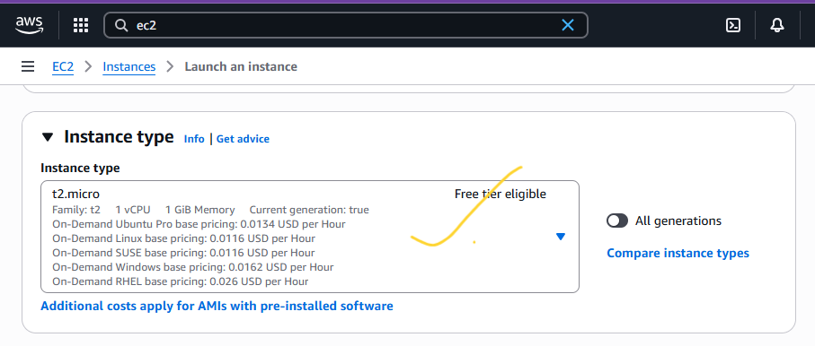
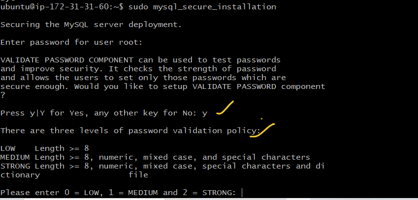
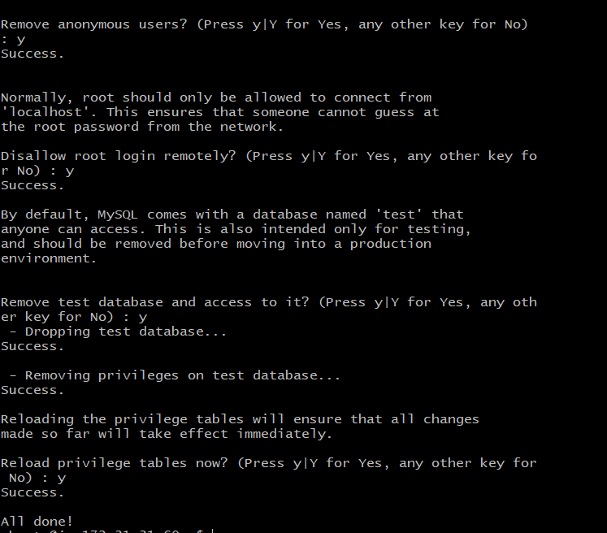
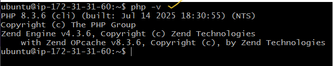

# LEMP Stack Implementation on AWS

## Overview
The **LEMP stack** is a web service solution stack consisting of:
- **L**inux – Operating system
- **E(N)**ginx – Web server
- **M**ySQL/MariaDB – Database
- **P**HP – Scripting language

We will deploy the LEMP stack on an Amazon EC2 instance running Ubuntu.

---

## 1. Prerequisites
Before starting, ensure you have:
1. An **AWS Account**.
2. Basic knowledge of **Linux commands**.
3. A **key pair** for SSH access.
4. AWS **security group rules** allowing:
   - HTTP (Port 80)
   - SSH (Port 22)
5. A local terminal (Linux/Mac/git bash) or **PuTTY** (Windows).

---

## 2. Step-by-Step Implementation

### Step 1: Launch an EC2 Instance
- Log into the AWS Management Console to setup the EC2 Instance.
---

---
- Search for **EC2  on the search bar**.
---

---
- Click on Launch Instance.
---

---
- Enter the name of your web server
---

---
- Choose **Ubuntu Server 22.04 LTS** (or latest version).
---

- Select an **instance type** (e.g., t2.micro for free tier).
---

- Configure **Security Group** to allow HTTP, HTTPS, SSH.
---

---
- Launch and download the `.pem` key pair or use an already created key pair.
---

---

---
- Configure the storage to what you prefer but we will leave everything default.
---

---
- Scroll down and at your right, click on Launch Instance.
---

---
- You should see this if everything is successful
---

---
- Make sure the status checks are all checked ensuring that our instance has been launched and running
---

---
- Now, copy the public IP Address of your instance
---

---
- Another way to retrieve your IP Address is to use this command
```bash
 TOKEN=`curl -X PUT "http://169.254.169.254/latest/api/token" -H "X-aws-ec2-metadata-token-ttl-seconds: 21600"` && curl -H "X-aws-ec2-metadata-token: $TOKEN" -s http://169.254.169.254/latest/meta-data/public-ipv4
```
- OR by this
```bash
 curl -s http://169.254.169.254/latest/meta-data/public-ipv4
```
---
### Step 2: Connect to Your Instance
From your terminal, cd Downloads/:
```bash
chmod 400 lamp-stack-kp.pem
ssh -i lamp-stack-kp.pem ubuntu@<EC2_PUBLIC_IP>
```
- Type `yes` 
---

---
- You're in when you see this
---

---

### Step 3: Update the System
```bash
sudo apt update && sudo apt upgrade -y
```

---

### Step 4: Install Nginx Web Server
```bash
sudo apt install nginx -y
```
---
Check the status of Nginx. If it's green, it means you did everything well
```bash
sudo systemctl status nginx
```
- You should see this if everything is well
---

---
- Test: Visit `http://<EC2_PUBLIC_IP>` in your browser.
---

---
- Test: You can also test in your terminal with these commands
```bash
curl http://localhost:80 
```
or
```bash
curl http://127.0.0.1:80
```
---

---

### Step 5: Installing MySQL
```bash
sudo apt install mysql-server -y
```
Verify MySQL:
```bash
sudo systemctl status mysql
```
---

---
Log into mysql by typing this command
```bash
sudo mysql
```
- You will see this:
---

---
Set a password for root user using mysql_native_password as default authentication method:
```bash
ALTER USER 'root'@'localhost' IDENTIFIED WITH mysql_native_password BY 'PassWord.1'; 
```
Exit the MySQL shell with:
```bash
exit
```
Start the interactive script:
```bash
sudo mysql_secure_installation
```
- This will ask if you want to configure the `VALIDATE PASSWORD PLUGIN`, type y. If you answer y, you'll be asked to select a level of password validation :
---

---

---
Test if you're able to log in by typing:
```bash
sudo mysql -p
```
NB: -p flag will prompt you for the password used after changing the root user password.
To exit the MySQL console, type:
```bash
exit
```

---

### Step 6: Install PHP
```bash
sudo apt install php-fpm php-mysql
```
---
- NB: php-fpm stands for "PHP fastCGI process manager". It tells Nginx to pass PHP requests to this software.
- php-mysql, php module that allows PHP to communicate with MySQL-based databases.
---
Check PHP version:
```bash
php -v
```

---

### Step 7: Configuring Nginx to Use PHP Processor
Create a directory for your website using `mkdir`. In our case:
```bash
sudo mkdir /var/www/projectLEMP
```
Assign ownership of directory to `$USER` environment variable, references your current system user:
```bash
sudo chown -R $USER:$USER /var/www/projectLEMP
```
Create and open a new configuration file in Nginx's `sites-available` directory using either vim or nano :
```bash
sudo nano /etc/nginx/sites-available/projectLEMP
```
Paste the following into the blank file:
```nginx
#/etc/nginx/sites-available/projectLEMP

server {
   listen 80;
   server_name projectLEMP www.projectLEMP;
   root /var/www/projectLEMP

   index index.html index.htm index.php;

   location / {
      try_files $uri $uri/ =404;
   }

   location ~ \.php$ {
      include snippets/fastcgi-php.conf;
      fastcgi_pass unix:/var/run/php/php8.3-fpm.sock;
   }

   location ~ /\.ht {
      deny all;
   }

}
```
To save and close the file completely:
- Hit the `ctrl + o` and Enter. That will save
- Type :
- Type `ctrl + x` to close the file
---
- NB: using `/var/www/projectLEMP` tells Nginx to serve projectLEMP using that as its web root directory.
- listen - Defines what port Nginx should listen on. In our case, port 80, default port of HTTP.
- server_name - defines which ip address or domain names the server should respond to.
---
Activate your configuration by linking to the config file from Nginx's `sites-enabled` directory:
```bash
sudo ln -s /etc/nginx/sites-available/projectLEMP /etc/nginx/sites-enabled
```
---
- NB: The above will tell Nginx to use the configuration when reloaded. 
---
Test your configuration:
```bash
sudo nginx -t
```
- It should look like this if everything is OK, if any errors check the config again:
---

---
Disable default Nginx host that is currently configured to listen on port 80:
```bash
sudo unlink /etc/nginx/sites-enabled/default
```
Reload Nginx to apply the changes:
```bash
sudo systemctl reload nginx
```
---
- NB: You can comment out anything in the configurate file with `#` at the beginning of each option's lines. 
---

### Step 8: Test PHP Processing
Create a test file for your empty web root:
```bash
sudo bash -c 'echo "Hello LEMP from hostname <b>$(TOKEN=$(curl -X PUT "http://169.254.169.254/latest/api/token" \
-H "X-aws-ec2-metadata-token-ttl-seconds: 21600") && curl -H "X-aws-ec2-metadata-token: $TOKEN" \
-s http://169.254.169.254/latest/meta-data/public-hostname)</b><br>with public IP <b>$(TOKEN=$(curl -X PUT \
"http://169.254.169.254/latest/api/token" -H "X-aws-ec2-metadata-token-ttl-seconds: 21600") && \
curl -H "X-aws-ec2-metadata-token: $TOKEN" -s http://169.254.169.254/latest/meta-data/public-ipv4)</b>" \
> /var/www/projectLEMP/index.html'

```
Visit:
```
http://<EC2_PUBLIC_IP>:80
```
- If you see the text from `echo` command you wrote to the index.html, then it means your Nginx is working. 
- NB: That index.html will always take precedence over other files with the default settings on Nginx.
---

### Step 9: Testing PHP with Nginx

##### Create a new file called `info.php` inside the document root:
```bash
nano /var/www/projectLEMP/info.php
```
Type or paste into the file:
```php
<?php
phpinfo();
?>
```
---
- NB: phpinfo() return information about your server.
---
You can access this page by visiting the ip address in your config file:
```php
http://`server_domain_or_IP`/info.php
```
- You should see this:

---
NB: After checking the info, it is best to remove the file as it contains sensitive information about your PHP environment and your Ubuntu server.  You use `rm` to remove that file. You can always get that file if you need it.
```bash
sudo rm /var/www/your_domain/info.php
```

### Step 10: Retrieving data from MySQL database with PHP
- Here, We will create a database with `To do list` and then access it and then let Nginx website query the data to display it.
---
Create Database named `student` and a user named `law`. Feel free to replace them. 😎
- First, we connect to MySQL console using the `root` account and enter password:
```bash
sudo mysql -u root -p
```
- Create Database  `student`:
```sql
CREATE DATABASE `student`;
```
- Create  a user  `law` using mysql_native_password as default authentication. 
```sql
CREATE USER 'law'@'%' IDENTIFIED WITH mysql_native_password BY 'PassWord.1' ;
```
- Grant `law` permission over the `student` database. 
```sql
GRANT ALL PRIVILEGES ON `student`.* TO 'law'@'%' ;
```
- NB: This gives `law` user full privileges over `student`. User cannot create or modify other databases on the server. 
---
- Exit MySQL shell with: 
```sql
exit ;
```
- Test if new user has proper permission by relogging in to the console again.: 
```sql
sudo mysql -u `user` -p
```
- Enter the password when prompted.
- Confirm you have access to the `student` database: 
```sql
SHOW DATABASES;
```
- This is the output:

---

### Step 11: Create Test Table
Create a test table named todo_list. Run this:
```sql
CREATE TABLE student.todo_list(
    item_id INT AUTO_INCREMENT,
    content VARCHAR (255),
    PRIMARY KEY (item_id)
);
```
Insert a few rows of content in the test table:
```sql
INSERT INTO student.todo_list (content) VALUES ("My first Important item");
INSERT INTO student.todo_list (content) VALUES ("My Second one I added is rought");
INSERT INTO student.todo_list (content) VALUES ("My third in the street");
```
To confirm that data is successfully saved into the table:
```sql
SELECT * FROM student.todo_list;
```
You should see something like this :
---

---
- Confirm and exit
```sql
exit;
```
---

### 12. PHP Scripts that connect to MySQL and Query for the Content
Create a new PHP file in custom web root directory:
```bash
nano /var/www/projectLEMP/todo_list.php
```
PHP script connect to MySQL and queries for content of the todo_list table, displaying results in a list:
```php
<?php
$user = 'law';
$password = 'PassWord.1';
$database= 'student';
$table = 'todo_list';

try {
   $db = new PDO ("mysql:host=localhost;dbname=$database", $user, $password);
   echo "<h2>TODO</h2><ol>";
   foreach ($db->query ("SELECT content FROM $table") as $row) {
      echo "<li>" . $row['content']  .  "</li>";
    }
    echo "</ol>";
} catch (PDOException $e) {
    print "Error!: " . $e->getMessage() . "<br/>";
    die();
}
?>
```
Save and close the file when done
---
Access this page in your web browser by visiting this:
---
```bash
http://<Public_domain_or_IP>/todo_list.php
```
You should see a page like this:
---

---

## 4. Cleanup
If you no longer need the setup:
- Terminate the EC2 instance from AWS Console.
- Delete associated security groups and key pairs.

---

## 5. Architecture Diagram


---
**End of Guide**
