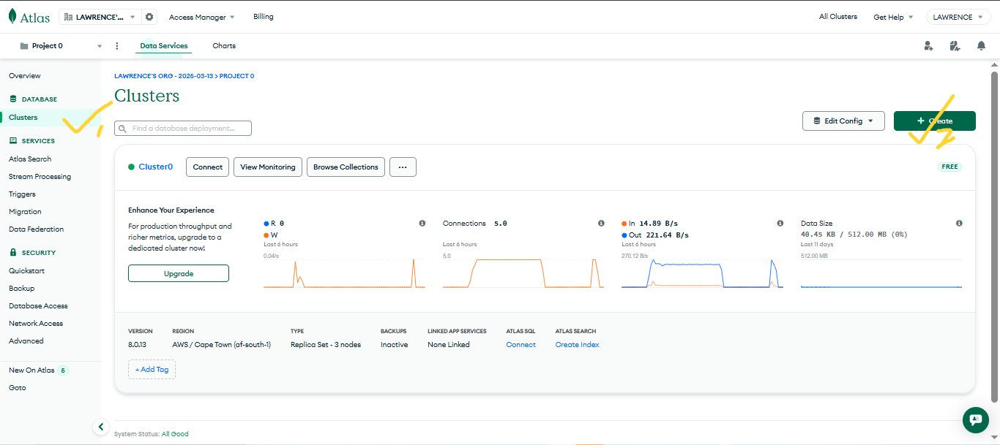
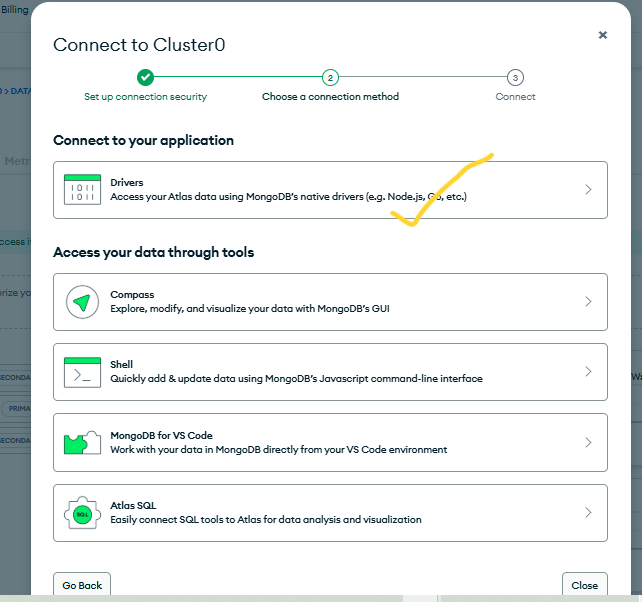
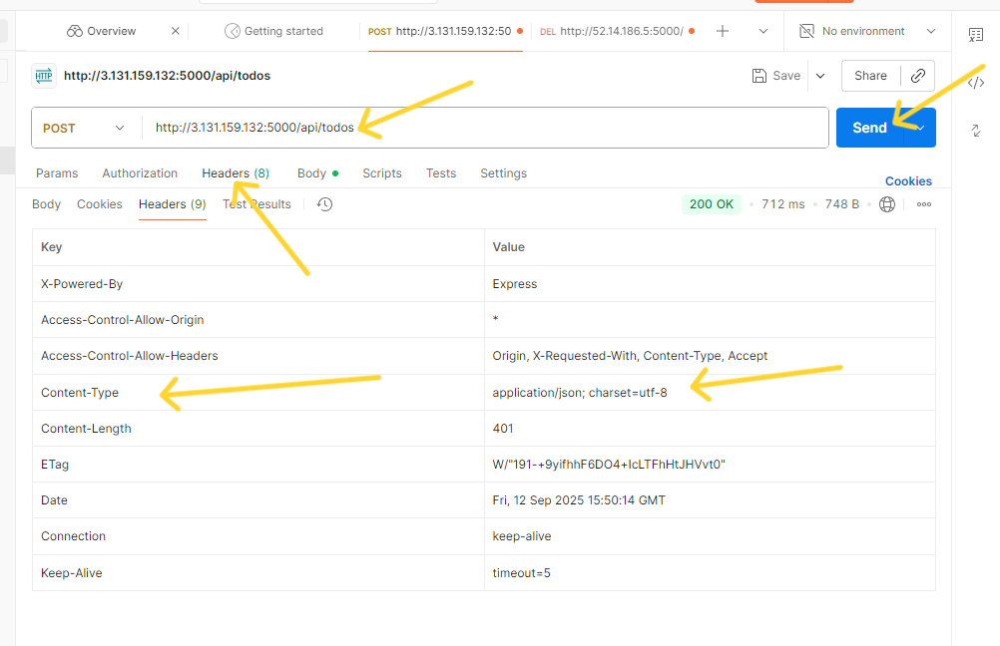
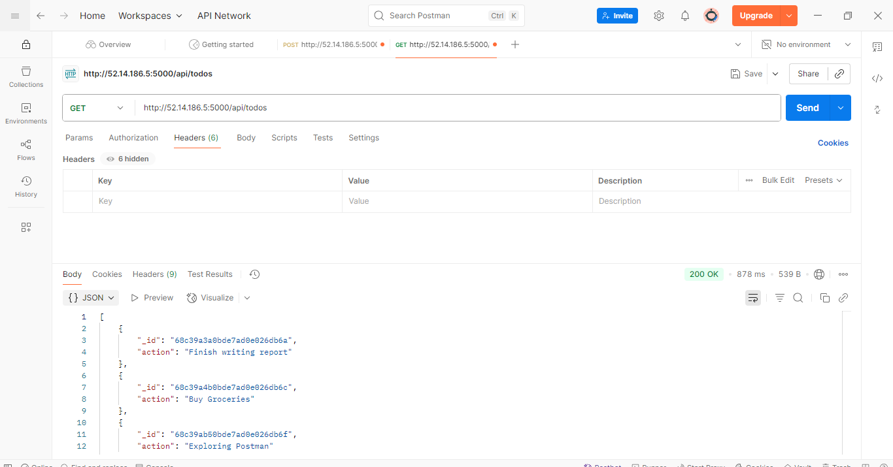
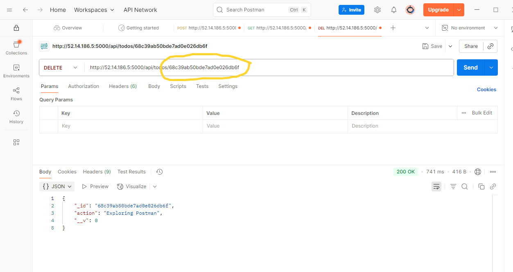

# MERN Stack Implementation on AWS
---
## Diagram

---
## Overview
The **MERN Stack** is a web service solution stack consisting of:
- **M**ongoDB – Document-based NO-SQL Database
- **E**xpressJS – Server side Web Application for Node.js
- **R**eactJS – A Frontend Framework based on Javascript
- **N**odeJS – A JavaScript Runtime Environment

We will deploy the MERN stack on an Amazon EC2 instance running Ubuntu.

---

## 1. Prerequisites
Before starting, ensure you have:
1. An **AWS Account**.
2. Basic knowledge of **Linux commands**.
3. A **key pair** for SSH access.
4. AWS **security group rules** allowing:
   - HTTP (Port 80)
   - SSH (Port 22)
   - Custom Port (Port 3000) - For the Frontend
   - Custom Port (Port 5000) - For the Backend
5. A local terminal (Linux/Mac/git bash) or **PuTTY** (Windows).

---

## 2. Step-by-Step Implementation

### Step 1: Launch an EC2 Instance
- Log into the AWS Management Console to setup the EC2 Instance.
---

---
- Search for **EC2  on the search bar**.
---

---
- Click on Launch Instance.
---

---
- Enter the name of your web server
---

---
- Choose **Ubuntu Server 22.04 LTS** (or latest version).
---

- Select an **instance type** (e.g., t2.micro for free tier).
---

- Configure **Security Group** to allow HTTP, HTTPS, SSH.
---

---
- Launch and download the `.pem` key pair or use an already created key pair.
---

---

---
- Configure the storage to what you prefer but we will leave everything default.
---

---
- Scroll down and at your right, click on Launch Instance.
---

---
- You should see this if everything is successful
---

---
- Make sure the status checks are all checked ensuring that our instance has been launched and running
---

---
- Now, copy the public IP Address of your instance
---

---
- Another way to retrieve your IP Address is to use this command
```bash
 TOKEN=`curl -X PUT "http://169.254.169.254/latest/api/token" -H "X-aws-ec2-metadata-token-ttl-seconds: 21600"` && curl -H "X-aws-ec2-metadata-token: $TOKEN" -s http://169.254.169.254/latest/meta-data/public-ipv4
```
- OR by this
```bash
 curl -s http://169.254.169.254/latest/meta-data/public-ipv4
```
---
### Step 2: Connect to Your Instance
From your terminal, cd Downloads/:
```bash
chmod 400 lamp-stack-kp.pem
ssh -i lamp-stack-kp.pem ubuntu@<EC2_PUBLIC_IP>
```
- Type `yes` 
---

---
- You're in when you see this
---

---

### Step 3: Update the System
```bash
sudo apt update && sudo apt upgrade -y
```

---

### Step 4: Install Node.js on the server
Get the location of Node.js from Ubuntu
```bash
curl -fsSL https://deb.nodesource.com/setup_24.x  | sudo  -E bash -
```
---
Install Node.js 
```bash
sudo apt-get install -y nodejs
```
- NB: This will install npm and nodejs. NPM is a package manager for Node like rpm for redis, apt for Ubuntu and yum for most unix/linux devices.
---
- Verify the node installation
```bash
node -v
```
- Verify the node installation
```bash
npm -v
```
### Step 5: Application Code Setup
- Create a new directory for the TO-DO project
```bash
mkdir Todo
```
- Change your current directory to the newly created Todo directory:
```bash
cd Todo
```
- Initialise your project
```bash
npm init
```
- NB: This will create `package.json` which contains information about your application and the dependencies that it needs to run. Press Enter to accept default values, then type yes to accept everything. 
---

---

### Step 6: Install ExpressJs
```bash
npm install express
```
- Create a file `index.js` with this command
```bash
touch index.js
```
- NB: Always `ls` to confirm whenever you create something be it a file or folder. 
---
-Install the `dotenv` module
```bash
npm install dotenv
```
- Open the `index.js` file with either vim or nano
```bash
vim index.js
```
or
```bash
nano index.js
```
- Copy the code and save:
```bash
const express = require('express');
require('dotenv').config();

const app = express();

const port = process.env.PORT || 5000;

app.use((req, res, next) => {
        res.header("Access-Control-Allow-Origin", "\*");
        res.header("Access-Control-Allow-Headers", "Origin, X-Requested-With, Content-Type, Accept");
        next();
});

app.use((req, res, next) => {
        res.send('Welcome to Express');
});

app.listen(port, () => {
        console.log(`Server running on port ${port}`)
});

```
- NB: The above code specifies the port 5000. This will be useful later. Use `:w` to save in vim and use `:qa` to exit vim and if you used nano, you can press `ctrl + o` then enter to save then `ctrl+x` to exit nano.
---
- Start the server to see if it works
```bash
node index.js
```
- You should see this if it works
- ---

- NB: Make sure you add the port number to the Security Group inbound rule  so that you can access the site. 
---
- Open your browser and acess your site
```bash
http://<PublicIP-or-PublicDNS>:5000
```
- If you don't know your IP address you can try this command for public ip address
```bash
curl -s http://169.254.169.254/latest/meta-data/public-ipv4
```
- Or this command for Public DNS name.
```bash
curl -s http://169.254.169.254/latest/meta-data/public-hostname
```
- Access your site
- ---


### Step 7: Routes
- Our TO-DO application will be doing three things:
   - Create a new task
   - Display list of all tasks
   - Delete a completed task.
      - Each task will used a standard HTTP requst methods like the `POST`, `GET`, `DELETE` respectively so we will have to create routes for each endpoints that the TO-DO app depends on. 
- Create a folder called `routes` inside `Todo`
```bash
mkdir routes
```
- Inside directory `routes` create a file `api.js` and copy these codes into it. We will update it later.
```bash
const express = require ('express');
const router = express.Router();

router.get('/todos', (req, res, next) => {
});

router.post('/todos', (req, res, next) => {
});

router.delete('/todos/:id', (req, res, next) => {
});

module.exports = router;
```
- Create Models directory inside `Todo` to make use of the Mongodb
```bash
mkdir models
```
---
- NB: Models are used to define database schema. This talks about how our data is constructed and also stored inside the database.
---
- Install `mongoose` to create a `Schema` and a `model`
```bash
npm install mongoose
```
- change directory to `models` and create a file `todo.js`
```bash
touch todo.js
```
- Copy and paste the code into `todo.js`
```bash
const mongoose = require('mongoose');
const Schema = mongoose.Schema;

//Create schema for todo
const TodoSchema = new Schema ({
action: {
type: String,
required: [true, 'The todo text field is required']
}
})

//Create model for todo
const Todo = mongoose.model('todo', TodoSchema);

module.exports = Todo;
```
To save and close the file completely with nano:
- Hit the `ctrl + o` and Enter. That will save the file
- Type `ctrl + x` to close the file
---
- Let's Update the `api.js` in our `routes` directory to make use of the new model
- Open `api.js` with `vim api.js`. Delete the existing code with this command `:%d`  and paste the code below into it. 
```bash
const express = require ('express');
const router = express.Router();
const Todo = require('../models/todo');

router.get('/todos', (req, res, next) => {

//this will return all the data, exposing only the id and action field to the client
Todo.find({}, 'action')
.then(data => res.json(data))
.catch(next)
});

router.post('/todos', (req, res, next) => {
if(req.body.action){
Todo.create(req.body)
.then(data => res.json(data))
.catch(next)
}else {
res.json({
error: "The input field is empty"
})
}
});

router.delete('/todos/:id', (req, res, next) => {
Todo.findOneAndDelete ({"_id": req.params.id})
.then(data => res.json(data))
.catch(next)
});

module.exports = router;
```
---
### Step 8: Setting Up MongoDB Database
- We will need a database to store our data. Here we will use MongoDB. So let's SignUp for a shared clusters free account. 
This is the Overview of the MongoDB pAGE
---

---
- Click on Network Access and make sure you allow access to the MongoDB database from anywhere (It's ideal for testing but not recommend in an actual environment).
---

---
- NB: TMake sure you change the time of deleting the entry from 6 Hours to 1 Week. 
---
#### Creating a MongoDB Database and Collection
- Click on Clusters
---

---
- Go through the options and create a cluster.
   - Give your cluster a name. 
   - Choose `aws` or any as a provider.
   - Choose a region closer to you.
   - Create the cluster deployment
---

---
- Click on Browse Collections
---

---
- Click on create database
---

---

---
- Enter the name you want to give your database then click `create`
---

---

---
### Step 9: Connecting the database
- In the `index.js` we specified `process.env` to access environment variables but that file is not created. Let's create that file. 
```bash
touch .env
vi .env
```
- Add the connection string to access the database in it as below:
```bash
DB = 'mongodb+srv://db_user:<db_password>@cluster0.mignz4q.mongodb.net/?retryWrites=true&w=majority&appName=Cluster0'
```
- NB: Ensure to update `<username>` in our case it is `db_user`, `<db_password>`, `<network-address>` in our case it is `cluster0.mignz4q.mongodb.net` and `<database>` according to your setup. 
---

### Step 10: How to get your connection string
- Go to the Clusters Overview Page. You will see `connect` button on your right. Click on it
---
- 
---
- Click on the `Drivers` where we have `connect to your application`
---
- 
---
- Select the `Driver` and the version depending on your setup. Then right beneath it, you will see the connection string. Copy it.
---
- 
---
- Since we have the connection string. We need to update the `index.js` to reflect the use of the `.env` so that Node.js can connect to the database. 
NB: You can delete the existing code in `index.js` by using the command in vim `:%d` after you have press esc. Then Hit `Enter`.
---
- Press `i` to enter the `insert` mode in vim and paste the code below
```bash
const express = require('express');
const bodyParser = require('body-parser');
const mongoose = require('mongoose');
const routes = require('./routes/api');
const path = require('path');
require('dotenv').config();

const app = express();
const port = process.env.PORT || 5000;

//connect to the database
mongoose.connect(process.env.DB, { useNewUrlParser: true, useUnifiedTopology: true })
.then( () => console.log(`Database connected successfully`))
.catch(err => console.log(err));

//since mongoose promise is deprecated, we overide it with node's promise
mongoose.Promise = global.Promise;

app.use((req, res, next) => {
res.header("Access-Control-Allow-Origin", "\*");
res.header("Access-Control-Allow-Headers", "Origin, X-Requested-With, Content-Type, Accept");
next();
});

app.use(bodyParser.json());
app.use('/api', routes);

app.use((err, req, res, next) => {
console.log(err);
next();
});

app.listen(port, () => {
console.log(`Server running on port ${port}`)
});
```
- Start your server using the command
```bash
node index.js
```
- You should see this
---

---
---
### Step 11: Testing Backend Code Without A Frontend using RESTFul API
- API stands for `Application Programming Interface`. Since we have only backend and configured the database, we will be working on our react frontend but since that is not yet done, we need to test our code by using RESTful API. In this case, we will use `Postman` to test our API. Install [Postman](https://www.postman.com/)
---
- Test all the API endpoints and make sure they are working. For the endpoint that require body, you should send JSON back with the necessary fields as per your code. 😎
---
- Create a `POST` request to the API with the url `http://<PublicIP-or-PublicDNS>:5000/api/todos`.  This will make a new task to our TO-DO list and will be stored in our database.
---

---
- Make sure you set `header` key `Content-Type` as `application/json`
---

---
- Create  a `GET` request to the API on the url `http://<PublicIP-or-PublicDNS>:5000/api/todos`. This will get all existing records from our TO-DO application which is stored in our database and display it as a response to our request. 
---

---
- If we want to delete any of our task, we send a `DELETE` request to delete the task from our TO-DO list application.
NB: Anytime you want to delete a task, don't forget that you will need its `ID` as part of the `DELETE` request as I have circled in the image below
---

---
- NB: This gives `law` user full privileges over `student`. User cannot create or modify other databases on the server. 
---
- Exit MySQL shell with: 
```sql
exit ;
```
- Test if new user has proper permission by relogging in to the console again.: 
```sql
sudo mysql -u `user` -p
```
- Enter the password when prompted.
- Confirm you have access to the `student` database: 
```sql
SHOW DATABASES;
```
- This is the output:
---

---

### Step 11: Create Test Table
Create a test table named todo_list. Run this:
```sql
CREATE TABLE student.todo_list(
    item_id INT AUTO_INCREMENT,
    content VARCHAR (255),
    PRIMARY KEY (item_id)
);
```
Insert a few rows of content in the test table:
```sql
INSERT INTO student.todo_list (content) VALUES ("My first Important item");
INSERT INTO student.todo_list (content) VALUES ("My Second one I added is rought");
INSERT INTO student.todo_list (content) VALUES ("My third in the street");
```
To confirm that data is successfully saved into the table:
```sql
SELECT * FROM student.todo_list;
```
- You should see something like this :
---

---
- Confirm and exit
```sql
exit;
```
---

### 12. PHP Scripts that connect to MySQL and Query for the Content
Create a new PHP file in custom web root directory:
```bash
nano /var/www/projectLEMP/todo_list.php
```
PHP script connect to MySQL and queries for content of the todo_list table, displaying results in a list:
```php
<?php
$user = 'law';
$password = 'PassWord.1';
$database= 'student';
$table = 'todo_list';

try {
   $db = new PDO ("mysql:host=localhost;dbname=$database", $user, $password);
   echo "<h2>TODO</h2><ol>";
   foreach ($db->query ("SELECT content FROM $table") as $row) {
      echo "<li>" . $row['content']  .  "</li>";
    }
    echo "</ol>";
} catch (PDOException $e) {
    print "Error!: " . $e->getMessage() . "<br/>";
    die();
}
?>
```
- Save and close the file when done
---
- Access this page in your web browser by visiting this:
---
```bash
http://<Public_domain_or_IP>/todo_list.php
```
- You should see a page like this:
---

---

## 4. Cleanup
If you no longer need the setup:
- Terminate the EC2 instance from AWS Console.
- Delete associated security groups and key pairs.

---
**End of Guide**
