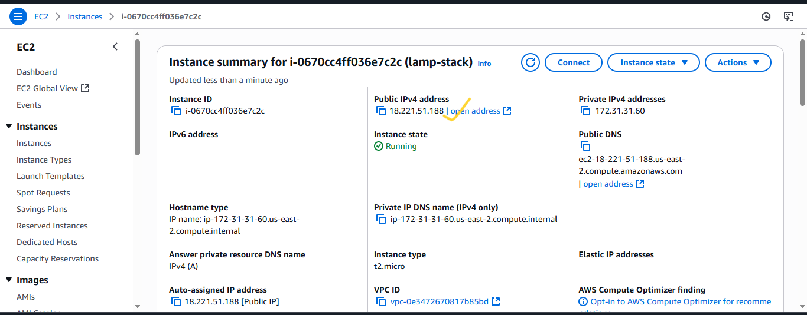

# MEAN Stack Implementation on AWS
---
## Diagram

---
## Overview
The **MEAN Stack** is a web service solution stack consisting of:
- **M**ongoDB – Document-based NO-SQL Database
- **E**xpressJS – Server side Web Application for Node.js
- **A**ngular – A Frontend Framework based on Javascript
- **N**odeJS – A JavaScript Runtime Environment

We will deploy the MEAN stack on an Amazon EC2 instance running Ubuntu.

---

## 1. Prerequisites
Before starting, ensure you have:
1. An **AWS Account**.
2. Basic knowledge of **Linux commands**.
3. A **key pair** for SSH access.
4. AWS **security group rules** allowing:
   - HTTP (Port 80)
   - SSH (Port 22)
   - Custom Port (Port 3000) - For the Frontend
   - Custom Port (Port 5000) - For the Backend
5. A local terminal (Linux/Mac/git bash) or **PuTTY** (Windows).

---

## 2. Step-by-Step Implementation

### Step 1: Launch an EC2 Instance
- Log into the AWS Management Console to setup the EC2 Instance.
---

---
- Search for **EC2  on the search bar**.
---

---
- Click on Launch Instance.
---

---
- Enter the name of your web server
---

---
- Choose **Ubuntu Server 22.04 LTS** (or latest version).
---

- Select an **instance type** (e.g., t2.micro for free tier).
---

- Configure **Security Group** to allow HTTP, HTTPS, SSH.
---

---
- Launch and download the `.pem` key pair or use an already created key pair.
---

---

---
- Configure the storage to what you prefer but we will leave everything default.
---

---
- Scroll down and at your right, click on Launch Instance.
---

---
- You should see this if everything is successful
---

---
- Make sure the status checks are all checked ensuring that our instance has been launched and running
---

---
- Now, copy the public IP Address of your instance
---

---
- Another way to retrieve your IP Address is to use this command
```bash
 TOKEN=`curl -X PUT "http://169.254.169.254/latest/api/token" -H "X-aws-ec2-metadata-token-ttl-seconds: 21600"` && curl -H "X-aws-ec2-metadata-token: $TOKEN" -s http://169.254.169.254/latest/meta-data/public-ipv4
```
- OR by this
```bash
 curl -s http://169.254.169.254/latest/meta-data/public-ipv4
```
---
### Step 2: Connect to Your Instance
From your terminal, cd Downloads/:
```bash
chmod 400 lamp-stack-kp.pem
ssh -i lamp-stack-kp.pem ubuntu@<EC2_PUBLIC_IP>
```
- Type `yes` 
---

---
- You're in when you see this
---

---

### Step 3: Update the System
```bash
sudo apt update && sudo apt upgrade -y
```

---

- I am going to the market

```bash
pip install nodejs
```
---
```python
pip install flask
```
---

