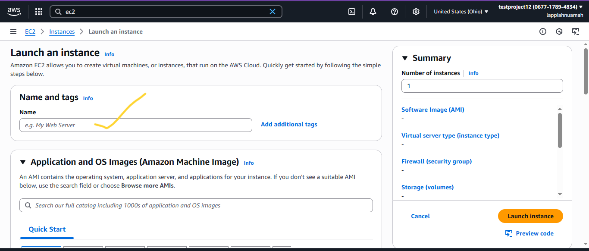
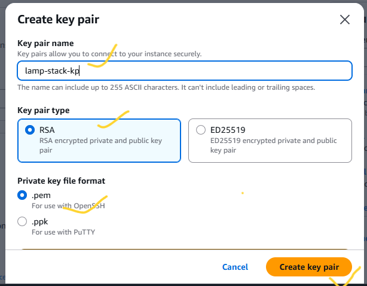
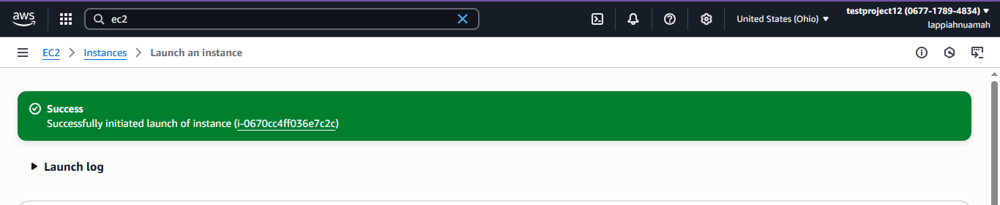

# MEAN Stack Implementation on AWS
---
## Diagram

---
## Overview
The **MEAN Stack** is a web service solution stack consisting of:
- **M**ongoDB – Document-based NO-SQL Database
- **E**xpressJS – Server side Web Application for Node.js
- **A**ngular – A Frontend Framework based on Javascript
- **N**odeJS – A JavaScript Runtime Environment

We will deploy the MEAN stack on an Amazon EC2 instance running Ubuntu.

---

## 1. Prerequisites
Before starting, ensure you have:
1. An **AWS Account**.
2. Basic knowledge of **Linux commands**.
3. A **key pair** for SSH access.
4. AWS **security group rules** allowing:
   - HTTP (Port 80)
   - SSH (Port 22)
   - Custom Port (Port 3300) - For the Frontend
5. A local terminal (Linux/Mac/git bash) or **PuTTY** (Windows).

---

## 2. Step-by-Step Implementation

### Step 1: Launch an EC2 Instance
- Log into the AWS Management Console to setup the EC2 Instance.
---

---
- Search for **EC2  on the search bar**.
---

---
- Click on Launch Instance.
---

---
- Enter the name of your web server
---

---
- Choose **Ubuntu Server 22.04 LTS** (or latest version).
---

- Select an **instance type** (e.g., t2.micro for free tier).
---

- Configure **Security Group** to allow HTTP, HTTPS, SSH.
---

---
- Launch and download the `.pem` key pair or use an already created key pair.
---

---

---
- Configure the storage to what you prefer but we will leave everything default.
---

---
- Scroll down and at your right, click on Launch Instance.
---

---
- You should see this if everything is successful
---

---
- Make sure the status checks are all checked ensuring that our instance has been launched and running
---

---
- Now, copy the public IP Address of your instance
---

---
- Another way to retrieve your IP Address is to use this command
```bash
 TOKEN=`curl -X PUT "http://169.254.169.254/latest/api/token" -H "X-aws-ec2-metadata-token-ttl-seconds: 21600"` && curl -H "X-aws-ec2-metadata-token: $TOKEN" -s http://169.254.169.254/latest/meta-data/public-ipv4
```
- OR by this
```bash
 curl -s http://169.254.169.254/latest/meta-data/public-ipv4
```
---
### Step 2: Connect to Your Instance
From your terminal, cd Downloads/:
```bash
chmod 400 lamp-stack-kp.pem
ssh -i lamp-stack-kp.pem ubuntu@<EC2_PUBLIC_IP>
```
- Type `yes` 
---

---
- You're in when you see this
---

---

### Step 3: Update and Upgrade the System
```bash
sudo apt update && sudo apt upgrade -y
```
---
### Step 4: Add Certificates and Install Nodejs
```bash
sudo apt -y install curl dirmngr apt-transport-https lsb-release ca-certificates
```
---
- Download a script from NodeSource. This actually configures our system so that we can install Node.js 18.x using apt.
```bash
curl -sL https://deb.nodesource.com/setup_18.x | sudo -E bash -
```
- Install Nodejs
```bash
sudo apt install -y nodejs
```
- Check if node has been installed
```bash
node -v
```
- Check if npm has been installed
```bash
npm -v
```
---
### Step 5: Install MongoDB
- Install gnupg and curl
```bash
sudo apt-get install -y gnupg curl
```
- Download MongoDB GPG key and save to keyring
```bash
curl -fsSL https://www.mongodb.org/static/pgp/server-7.0.asc | \
  sudo gpg -o /usr/share/keyrings/mongodb-server-7.0.gpg --dearmor
```
- Create MongoDB APT repository so that apt can easily fetch MongoDB Packages.
```bash
echo "deb [arch=amd64,arm64 signed-by=/usr/share/keyrings/mongodb-server-7.0.gpg] https://repo.mongodb.org/apt/ubuntu jammy/mongodb-org/7.0 multiverse" | \
sudo tee /etc/apt/sources.list.d/mongodb-org-7.0.list
```
---

---
- Update your system again
```bash
sudo apt-get update
```
- Install MongoDB
```bash
sudo apt-get install -y mongodb-org
```
- Start MongoDB service
```bash
sudo systemctl start mongod
```
- Enable to start on boot
```bash
sudo systemctl enable mongod
```
- Check status on mongod
```bash
sudo systemctl status mongod
```
---

---
- Check 
```bash
sudo systemctl status mongod
```
### Step 6: Creation of Project Files and Installation of Packages
- Create a folder called `Books`
```bash
mkdir Books && cd Books
```
- In the `Books` directory, initialize your node project 
```bash
npm init
```
- Create a file `server.js`
```bash
vi server.js
```
- Copy and paste the web server code into `server.js`
```javascript
const express = require('express');
const bodyParser = require('body-parser');
const mongoose = require('mongoose');
const path = require('path');

const app = express();
const PORT = process.env.PORT || 3300;

// MongoDB connection
mongoose.connect('mongodb://localhost:27017/test', {
        useNewUrlParser: true,
        useUnifiedTopology: true,
})
.then(()=> console.log('MongoDB connected'))
.catch(err => console.error('MongoDB connection error:', err));

app.use(express.static(path.json(_dirname, 'public')));
app.use(bodyParser.json());

require('./apps/routes')(app);

app.listen(PORT, () => {
    console.log(`Server up: http://localhost:${PORT}`);

});

```
#### Installation Express and setup routes to the server
- Install Express and Mongoose inside the `Books` directory
```bash
sudo npm install express mongoose
```
- You can check the version and verify if it has been installed
```bash
npm ls
```
---

---
- In the `Books` directory, created a folder named `apps`
```bash
mkdir apps && cd apps
```
- Inside `apps` create `routes.js`
```bash
vi routes.js
```
- Copy and paste these codes in `routes.js`
```javascript
const Book = require('./models/book');
const path = require('path');

module.exports = function (app) {
  app.get('/book', async (req, res) => {
    try {
      const books = await Book.find();
      res.json(books);
    } catch (err) {
      res.status(500).json({ message: 'Error fetching books', error: err.message });
    }
  });

  app.post('/book', async (req, res) => {
    try {
      const book = new Book({
        name: req.body.name,
        isbn: req.body.isbn,
        author: req.body.author,
        pages: req.body.pages
      });
      const savedBook = await book.save();
      res.status(201).json({ message: 'Successfully added book', book: savedBook });
    } catch (err) {
      res.status(400).json({ message: 'Error adding book', error: err.message });
    }
  });

  app.put('/book/:isbn', async (req, res) => {
    try {
      const updated = await Book.findOneAndUpdate(
        { isbn: req.params.isbn },
        {
          name: req.body.name,
          author: req.body.author,
          pages: req.body.pages
        },
        { new: true }
      );

      if (!updated) return res.status(404).json({ message: 'Book not found' });

      res.json({ message: 'Book updated successfully', book: updated });
    } catch (err) {
      res.status(500).json({ message: 'Error updating book', error: err.message });
    }
  });

  app.delete('/book/:isbn', async (req, res) => {
    try {
      const result = await Book.findOneAndDelete({ isbn: req.params.isbn });
      if (!result) return res.status(404).json({ message: 'Book not found' });

      res.json({ message: 'Successfully deleted the book', book: result });
    } catch (err) {
      res.status(500).json({ message: 'Error deleting book', error: err.message });
    }
  });

  // Catch-all route for SPA
  app.get('/{*path}', (req, res) => {
    res.sendFile(path.join(__dirname, '../public/index.html'));
  });
};

```
- In the `apps` directory create a directory called `models`
```bash
mkdir models && cd models
```
- Create a file called `book.js` which contains our model
```bash
vi book.js
```
- Copy and paste these codes into `book.js`
```javascript

const mongoose = require('mongoose');

const bookSchema = new mongoose.Schema({
    name: { type: String, required: true },
    isbn: { type: String, required: true, unique: true, index: true },
    author: { type: String, required: true },
    pages: { type: Number, required: true, min: 1 }
}, {
    timestamps: true
});

module.exports = mongoose.model('Book', bookSchema);

```
---
### Step 7: Access the routes with AngularJs
- Change directory to `Books`
```bash
cd ../..
```
- Create a directory called `public`
```bash
mkdir public && cd public
```
- Create a file called `script.js`
```bash
vi script.js
```
- Copy and paste the code into `script.js`
```javascript
angular.module('myApp', [])
.controller('myCtrl', function($scope, $http) {
  $scope.editing = false;

  function fetchBooks() {
    $http.get('/book')
      .then(response => {
        $scope.books = response.data;
      })
      .catch(error => {
        console.error('Error fetching books:', error);
      });
  }
  fetchBooks();

  $scope.add_book = function() {
    const newBook = {
      name: $scope.Name,
      isbn: $scope.Isbn,
      author: $scope.Author,
      pages: $scope.Pages
    };

    $http.post('/book', newBook)
      .then(() => {
        fetchBooks();
        resetForm();
      })
      .catch(error => console.error('Error adding book:', error));
  };

  $scope.del_book = function(book) {
    if (!confirm(`Delete "${book.name}"?`)) return;
    $http.delete(`/book/${book.isbn}`)
      .then(() => fetchBooks())
      .catch(error => console.error('Error deleting book:', error));
  };

  $scope.edit_book = function(book) {
    $scope.editing = true;
    $scope.Name = book.name;
    $scope.Isbn = book.isbn;
    $scope.Author = book.author;
    $scope.Pages = book.pages;
  };

  $scope.update_book = function() {
    const updatedBook = {
      name: $scope.Name,
      author: $scope.Author,
      pages: $scope.Pages
    };

    $http.put(`/book/${$scope.Isbn}`, updatedBook)
      .then(() => {
        fetchBooks();
        resetForm();
        $scope.editing = false;
      })
      .catch(error => console.error('Error updating book:', error));
  };

  $scope.cancel_edit = function() {
    resetForm();
    $scope.editing = false;
  };

  function resetForm() {
    $scope.Name = '';
    $scope.Isbn = '';
    $scope.Author = '';
    $scope.Pages = '';
  }
});

```
- In that same  `public` folder, create a file called `index.html`
```bash
vi index.html
```
- Copy and paste the codes into `index.html`
```html
<!DOCTYPE html>
<html ng-app="myApp" ng-controller="myCtrl">
<head>
  <meta charset="UTF-8">
  <meta name="viewport" content="width=device-width, initial-scale=1.0">
  <title>Book Management</title>
  <script src="https://ajax.googleapis.com/ajax/libs/angularjs/1.8.2/angular.min.js"></script>
  <script src="script.js"></script>
  <style>
    body {
      font-family: Arial, sans-serif;
      margin: 20px;
      background: #f8f9fa;
    }
    h1, h2 {
      color: #333;
    }
    table {
      border-collapse: collapse;
      width: 100%;
      margin-top: 10px;
      background: white;
      box-shadow: 0 2px 5px rgba(0,0,0,0.1);
    }
    th, td {
      border: 1px solid #ddd;
      padding: 10px;
      text-align: left;
    }
    th {
      background: #f1f1f1;
    }
    input[type="text"], input[type="number"] {
      width: 95%;
      padding: 6px;
      border: 1px solid #ccc;
      border-radius: 5px;
    }
    button {
      margin: 3px;
      padding: 5px 10px;
      border: none;
      border-radius: 5px;
      cursor: pointer;
    }
    button.add {
      background-color: #007bff;
      color: white;
    }
    button.edit {
      background-color: #28a745;
      color: white;
    }
    button.delete {
      background-color: #dc3545;
      color: white;
    }
  </style>
</head>
<body>
  <h1>Book Management</h1>
  <h2>{{ editing ? "Edit Book" : "Add New Book" }}</h2>

  <form ng-submit="editing ? update_book() : add_book()">
    <table>
      <tr>
        <td>Name:</td>
        <td><input type="text" ng-model="Name" required></td>
      </tr>
      <tr>
        <td>ISBN:</td>
        <td><input type="text" ng-model="Isbn" required ng-disabled="editing"></td>
      </tr>
      <tr>
        <td>Author:</td>
        <td><input type="text" ng-model="Author" required></td>
      </tr>
      <tr>
        <td>Pages:</td>
        <td><input type="number" ng-model="Pages" required></td>
      </tr>
    </table>
    <button type="submit" class="add">{{ editing ? "Update Book" : "Add Book" }}</button>
    <button type="button" ng-if="editing" ng-click="cancel_edit()">Cancel</button>
  </form>

  <h2>Book List</h2>
  <table>
    <thead>
      <tr>
        <th>Name</th>
        <th>ISBN</th>
        <th>Author</th>
        <th>Pages</th>
        <th>Action</th>
      </tr>
    </thead>
    <tbody>
      <tr ng-repeat="book in books">
        <td>{{book.name}}</td>
        <td>{{book.isbn}}</td>
        <td>{{book.author}}</td>
        <td>{{book.pages}}</td>
        <td>
          <button class="edit" ng-click="edit_book(book)">Edit</button>
          <button class="delete" ng-click="del_book(book)">Delete</button>
        </td>
      </tr>
    </tbody>
  </table>
</body>
</html>

```
