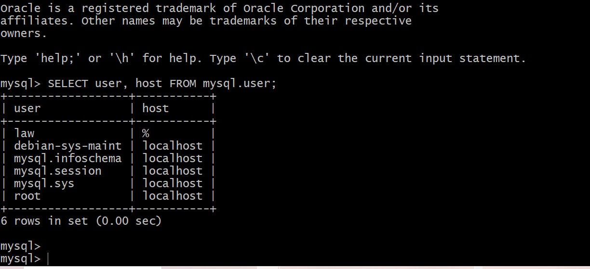
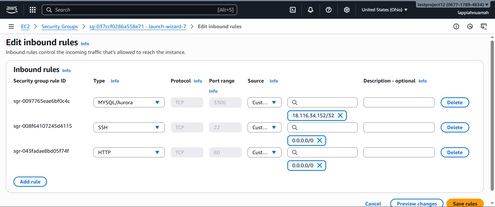
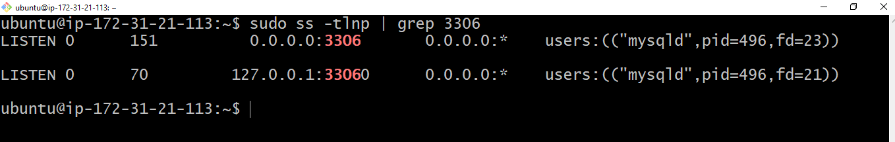
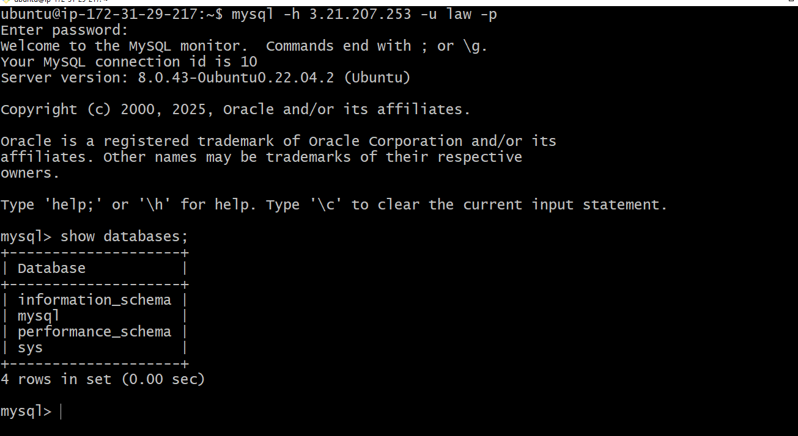

# MySQL Server & Client Setup (Two Linux Servers)

This guide walks through setting up **two Linux servers**, installing **MySQL Server** on one, **MySQL Client** on the other, and connecting them over the network.

---

## 1. Prerequisites

- Two Linux servers (physical, virtual machines, or AWS EC2 instances).
- Both servers must be able to communicate over the network (ping works).
- `sudo` privileges on both servers.
- Open port `3306` on the MySQL server (firewall or security group).

---

## 2. Setup Overview

- **Server 1 (MySQL Server):** Runs MySQL server and hosts the database.
- **Server 2 (MySQL Client):** Runs MySQL client to connect to the server remotely.

Architecture:<br />
+------------------+ +------------------+ <br />
| MySQL Server | <----> | MySQL Client | <br />
| (Server 1) | Port 3306 | (Server 2) | <br />
+------------------+ +------------------+


---

## 3. Install MySQL Server on Server 1

Update and install MySQL server:

```bash
sudo apt update && sudo apt upgrade -y
sudo apt install mysql-server -y
```
Verify MySQL is running:
```bash
sudo systemctl status mysql
```
Enable on boot:
```bash
sudo systemctl enable mysql
```
## 4. Configure MySQL for Remote Access

Edit MySQL Configuration
```bash
sudo nano /etc/mysql/mysql.conf.d/mysqld.cnf
```
Change:
```bash
bind-address = 127.0.0.1
```
To:
```bash
bind-address = 0.0.0.0
```
Save and restart MySQL:
```bash
sudo systemctl restart mysql
```
## 5. Create Remote User

Log into MySQL shell:
```bash
sudo mysql -u root
```
Create a user and grant permissions:
Log into MySQL shell:
```bash
CREATE USER 'law'@'%' IDENTIFIED BY 'StrongPassword123!';
GRANT ALL PRIVILEGES ON *.* TO 'law'@'%' WITH GRANT OPTION;
FLUSH PRIVILEGES;

```
Check the user list:
```bash
SELECT user, host FROM mysql.user;
```
---

---
- As you can see `law` in the list of users.
---
## 6. Allow Port 3306 in Firewall / Security Group

If using UFW on the server:
```bash
sudo ufw allow 3306/tcp
sudo ufw reload
```
If using AWS EC2, open Security Group inbound rule:

- Type: MySQL/Aurora

- Port: 3306

- Source: 0.0.0.0/0 (or your client’s public IP)
---

---
## 7. Verify MySQL is Listening

Run on server:
```bash
sudo ss -tlnp | grep 3306

```
---

---
## 8. Install MySQL Client on Server 2

Run on the client server:
```bash
sudo apt update
sudo apt install mysql-client -y

```
### Test Network Connectivity

Before connecting, test if the port is open:
```bash
nc -zv <SERVER_1_IP> 3306
```
Expected output:
---

If it fails, check firewall/security group settings.
## 9. Connect to MySQL from Client

Run:
```bash
mysql -h <SERVER_1_IP> -u law -p

```
Enter your password and you should be inside the MySQL shell. Test by running:
```bash
SHOW DATABASES;
```
---

---
## 10. Troubleshooting
| Issue                 | Cause                           | Solution                                         |
| --------------------- | ------------------------------- | ------------------------------------------------ |
| Connection hangs      | Port blocked / SG misconfigured | Open port 3306 in firewall or AWS Security Group |
| `Access denied` error | User host is not `%`            | Create user with `CREATE USER 'law'@'%' ...`     |
| Can't connect         | MySQL not listening externally  | Set `bind-address = 0.0.0.0` and restart MySQL   |
| Connection refused    | MySQL not running               | `sudo systemctl start mysql`                     |


## 12. Security Best Practices

- Avoid using GRANT ALL PRIVILEGES ON *.* in production.

- Restrict remote access to only the client’s IP instead of %.

- Use strong, unique passwords.

- Consider enabling SSL for MySQL connections.

## 13. Summary

You have successfully:

1. Installed MySQL server on Server 1.

2. Configured it for remote connections.

3. Created a remote user with privileges.

4. Installed MySQL client on Server 2.

5. Connected from client to server over the network.
