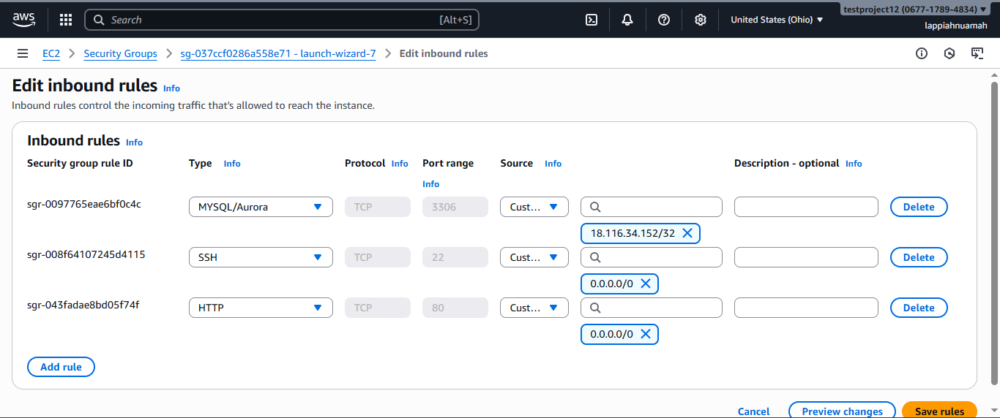

# Web Solution With Wordpress

This guide walks through setting up storage infrastructure on **two Linux servers (RHEL 9)**, and implementing a basic web solution using **WordPress**. WordPress is an open-source content management system written in PHP and paired with MySQL or MariaDB as Backend. 

---

## 1. Prerequisites

- Two RHEL 9 Linux servers (physical, virtual machines, or AWS EC2 instances), one serving as a wordpress server and the other MySQL server.
- Open port `3306` on the MySQL server (firewall or security group).

---

## 2. Project Objectives

- Configure storage subsystem for Web and Database servers based on Linux OS. 
<br>
- Install WordPress and connect it to a remote MySQL database server. 
---


## 3. Prepare a Web Server
You can check how to launch an instance here 
- **Project 1: [Deploy a Complete LAMP Stack on AWS](https://github.com/lappiahnuamah/DevOps-CloudEngr-StegHub/tree/main/1.LAMP_Stack)** 
---
- After create a redhat ec2 instance, create 3 volumes in the same `Availability Zone (AZ)` as your web server each of size `10 GB`
- This is how to create a volume and attach to an ec2 instance. Click on Volumes on your left
---

---
- Click on `Create Volume`
---

---
- Make the size `10GB`
---

---
- Make the `Availability Zone` the same as your web server. For example in our case `us-east-2b`. Then click on create volume.
---

---
- Open the volume you created to attach to a webserver. Then click on `Actions`.
---

---
- Click on `Attach Volume` from the drop down.
---

---
- Choose the instance you want to attach the volume to and  the device name as well.
NB: Create 3 volumes for the webserver and 3 volume for the MySQL server, each of sizer 10GB and attach respectively.
---

---


```bash
sudo apt update && sudo apt upgrade -y
sudo apt install mysql-server -y
```
Verify MySQL is running:
```bash
sudo systemctl status mysql
```
Enable on boot:
```bash
sudo systemctl enable mysql
```
## 4. Configure MySQL for Remote Access

Edit MySQL Configuration
```bash
sudo nano /etc/mysql/mysql.conf.d/mysqld.cnf
```
Change:
```bash
bind-address = 127.0.0.1
```
To:
```bash
bind-address = 0.0.0.0
```
Save and restart MySQL:
```bash
sudo systemctl restart mysql
```
## 5. Create Remote User

Log into MySQL shell:
```bash
sudo mysql -u root
```
Create a user and grant permissions:
Log into MySQL shell:
```bash
CREATE USER 'law'@'%' IDENTIFIED BY 'StrongPassword123!';
GRANT ALL PRIVILEGES ON *.* TO 'law'@'%' WITH GRANT OPTION;
FLUSH PRIVILEGES;

```
Check the user list:
```bash
SELECT user, host FROM mysql.user;
```
---

---
As you can see `law` in the list of users.
---
## 6. Allow Port 3306 in Firewall / Security Group

If using UFW on the server:
```bash
sudo ufw allow 3306/tcp
sudo ufw reload
```
If using AWS EC2, open Security Group inbound rule:

- Type: MySQL/Aurora

- Port: 3306

- Source: 0.0.0.0/0 (or your client’s public IP)
---

---
## 7. Verify MySQL is Listening

Run on server:
```bash
sudo ss -tlnp | grep 3306

```
---

---
## 8. Install MySQL Client on Server 2

Run on the client server:
```bash
sudo apt update
sudo apt install mysql-client -y

```
### Test Network Connectivity

Before connecting, test if the port is open:
```bash
nc -zv <SERVER_1_IP> 3306
```
Expected output:
---

If it fails, check firewall/security group settings.
## 9. Connect to MySQL from Client

Run:
```bash
mysql -h <SERVER_1_IP> -u law -p

```
Enter your password and you should be inside the MySQL shell. Test by running:
```bash
SHOW DATABASES;
```
---

---
## 10. Troubleshooting
| Issue                 | Cause                           | Solution                                         |
| --------------------- | ------------------------------- | ------------------------------------------------ |
| Connection hangs      | Port blocked / SG misconfigured | Open port 3306 in firewall or AWS Security Group |
| `Access denied` error | User host is not `%`            | Create user with `CREATE USER 'law'@'%' ...`     |
| Can't connect         | MySQL not listening externally  | Set `bind-address = 0.0.0.0` and restart MySQL   |
| Connection refused    | MySQL not running               | `sudo systemctl start mysql`                     |


## 12. Security Best Practices

- Avoid using GRANT ALL PRIVILEGES ON *.* in production.

- Restrict remote access to only the client’s IP instead of %.

- Use strong, unique passwords.

- Consider enabling SSL for MySQL connections.

## 13. Summary

You have successfully:

1. Installed MySQL server on Server 1.

2. Configured it for remote connections.

3. Created a remote user with privileges.

4. Installed MySQL client on Server 2.

5. Connected from client to server over the network.