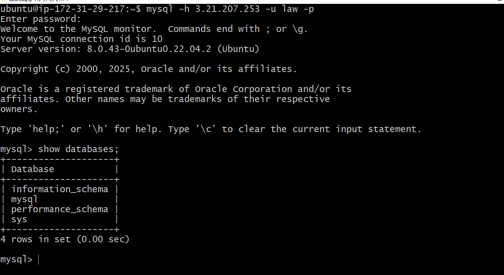

# Web Solution With Wordpress

This guide walks through setting up storage infrastructure on **two Linux servers (RHEL 9)**, and implementing a basic web solution using **WordPress**. WordPress is an open-source content management system written in PHP and paired with MySQL or MariaDB as Backend. 

---

## 1. Prerequisites

- Two RHEL 9 Linux servers (physical, virtual machines, or AWS EC2 instances), one serving as a wordpress server and the other MySQL server.
- Open port `3306` on the MySQL server (firewall or security group).

---

## 2. Project Objectives

- Configure storage subsystem for Web and Database servers based on Linux OS. 
- Install WordPress and connect it to a remote MySQL database server. 
---


## 3. Prepare a Web Server
You can check how to launch an instance here 
- **Project 1: [Deploy a Complete LAMP Stack on AWS](https://github.com/lappiahnuamah/DevOps-CloudEngr-StegHub/tree/main/1.LAMP_Stack)** 
---
- After create a redhat ec2 instance, create 3 volumes in the same `Availability Zone (AZ)` as your web server each of size `10 GB`
- This is how to create a volume and attach to an ec2 instance. Click on Volumes on your left
---

---
- Click on `Create Volume`
---

---
- Make the size `10GB`
---

---
- Make the `Availability Zone` the same as your web server. For example in our case `us-east-2b`. Then click on create volume.
---

---
- Open the volume you created to attach to a webserver. Then click on `Actions`.
---

---
- Click on `Attach Volume` from the drop down.
---

---
- Choose the instance you want to attach the volume to and  the device name as well.
NB: Create 3 volumes for the webserver and 3 volume for the MySQL server, each of sizer 10GB and attach respectively.
---

---
- Scroll down and Click on `Attach Volume`
---

---

## 4. Configurations

Open the bash terminal. Use `lsblk` commmand to inspect what block devices are attached to the server you are on. NB: All devices in linux are in `/dev/` directory.
```bash
sudo lsblk
```
---

---
Enter `df -h` to see all mounts and free space on the server
```bash
df -h
```
---

---
Enter `gdisk` to create a partition on each of the 3 disks
```bash
sudo gdisk /dev/xvdbf
```
---

---

---
Use `lsblk` utility to view newly configured partition on each of the 3 disks
```bash
lsblk
``` 
---

---
Install `lvm2` with
```bash
sudo yum install lvm2
``` 
Check partitions using `lvm2` with
```bash
lvmdiskscan
``` 
Use `pvcreate` to mark each of the 3 disks as physical volumes
```bash
sudo pvcreate /dev/xvdbf1
sudo pvcreate /dev/xvdbg1
sudo pvcreate /dev/xvdbh1
``` 
Verify created `Volumes` 
```bash
sudo pvs
``` 
---

---
Now let's add all the 3 PVs to a volume group (VG). We will use the `vgcreate`. We will name our VG as `webdata-vg`. You can name the database volume group as `dbdata-vg` if you want. 
```bash
sudo vgcreate webdata-vg /dev/xvdbh1 /dev/xvdbg1  /dev/xvdbf1
``` 
Verify created `Volume Group` 
```bash
sudo vgs
``` 
---

---
Now let's create 2 logical volumes called `apps-lv` (Half of the PV size) and `logs-lv` (The other half).
NB: `apps-lv` is used to store data for the website. and `logs-lv` is used to store data for logs. The command we can use is `lvcreate`
```bash
sudo lvcreate -n apps-lv -L 14G webdata-vg
sudo lvcreate -n logs-lv -L 14G webdata-vg
``` 
Verify created `Logical Volumes` 
```bash
sudo lvs
``` 
---

---
Verify the entire setup
```bash
sudo vgdisplay -v
``` 
---

---
Use `mkfs.ext4` to format the logical volumes with `ext4`filesystem.
```bash
sudo mkfs -t ext4 /dev/webdata-vg/apps-lv
sudo mkfs -t ext4 /dev/webdata-vg/logs-lv
``` 
---

---

---
Create `/var/www/html` directory to store website files.
```bash
sudo mkdir -p /var/www/html
``` 
Create `/home/recovery/logs` directory to backup of log data.
```bash
sudo mkdir -p /home/recovery/logs
``` 
Mount  `/var/www/html` on `apps-lv` logical volume
```bash
sudo mount /dev/webdata-vg/apps-lv /var/www/html/
```
Use `rsync` Utility to backup all the files in the log directory `/var/log` into `/home/recovery/logs` (This is required before mounting the file system)
```bash
sudo rsync -av /var/log/ /home/recovery/logs/
``` 
Mount `/var/log` on `logs-lv` logical volume. 
```bash
sudo mount /dev/webdata-vg/logs-lv /var/log
``` 
Restore log files back into `/var/log` directory
```bash
sudo rsync -av /home/recovery/logs/ /var/log
``` 
Update `/etc/fstab` file with the `UUID` from `blkid` so that the mount configuration will persist after restarting the server.

```bash
sudo blkid
``` 
---

---
Update `/etc/fstab` with your own UUID. Remove the quotes.

```bash
sudo vi /etc/fstab
``` 
---

---
Test the configuration and reload the daemon

```bash
sudo mount -a
sudo systemctl daemon-reload
``` 
Verify by running
```bash
df -h
``` 
## 5. Prepare the Database Server

Launch a second RedHat EC2 instance and repeat the same steps as as you did for the wordpress server but instead of `apps-lv`. Create `db-lv` and mount it to `/db` directory instead of `/var/www/html/`. 

---
## 6. Install WordPress on the Web Server 

Update the repository:
```bash
sudo yum -y update
```
Install `wget`, `Apache` and it's dependencies
```bash
sudo yum -y install wget httpd php php-mysqlnd php-fpm php-json
```
Start Apache:
```bash
sudo systemctl enable httpd
sudo systemctl start httpd
sudo systemctl status httpd
```
Configure a Free AlmaLinux Repo on RHEL 9
```bash
sudo tee /etc/yum.repos.d/almalinux.repo <<'EOF'
[baseos]
name=AlmaLinux 9 - BaseOS
baseurl=http://repo.almalinux.org/almalinux/9/BaseOS/x86_64/os/
enabled=1
gpgcheck=0

[appstream]
name=AlmaLinux 9 - AppStream
baseurl=http://repo.almalinux.org/almalinux/9/AppStream/x86_64/os/
enabled=1
gpgcheck=0

[extras]
name=AlmaLinux 9 - Extras
baseurl=http://repo.almalinux.org/almalinux/9/extras/x86_64/os/
enabled=1
gpgcheck=0
EOF

```
Rebuild Cache
```bash
sudo dnf clean all
sudo dnf makecache
```
Now install PHP
```bash
sudo dnf install php php-cli php-fpm php-common php-opache php-gd php-curl php-mysqlnd -y

```
---
```bash
sudo systemctl start php-fpm
sudo systemctl enable php-fpm
setsebool -P httpd_execmem 1
```
Restart Apache
```bash
sudo systemctl restart httpd
```
Download WordPress and copy wordpress to `/var/www/html`
```bash
mkdir wordpress && cd wordpress
sudo wget http://wordpress.org/latest.tar.gz
sudo tar -xzvf latest.tar.gz
sudo rm -rf latest.tar.gz
```
---
```bash
cp wordpress/wp-config-sample.php wordpress/wp-config.php
cp -R wordpress /var/www/html/
```
Configure SELinux Policies
```bash
sudo chown -R apache:apache /var/www/html/wordpress
sudo chcon -t httpd_sys_rw_content_t /var/www/html/wordpress -R 
sudo setsebool -P httpd_can_network_connect=1
```
## 7. Install MySQL on your DB Server EC2

Install MySQL
```bash
sudo yum update
sudo yum install mysql-server
```
Verify MySQL 
```bash
sudo systemctl restart mysqld
sudo systemctl enable mysqld
```
Configure DB to work with WordPress
```bash
sudo mysqld
CREATE DATABASE wordpress;
CREATE USER `myuser`@`<Web-Server-Private-IP-Address>`
IDENTIFIED BY 'mypass';
GRANT ALL ON wordpress.* TO 'myuser'@'<Web-Server-Private-IP-Address>';
FLUSH PRIVILEGES;
SHOW DATABASES;
exit
```
Confiure WordPress to connect to Remote Database.
```bash
sudo yum update
sudo yum install mysql-server
```
---
## 8. Install MySQL Client on Server 2

Run on the client server:
```bash
sudo apt update
sudo apt install mysql-client -y

```
### Test Network Connectivity

Before connecting, test if the port is open:
```bash
nc -zv <SERVER_1_IP> 3306
```
Expected output:
---

If it fails, check firewall/security group settings.
## 9. Connect to MySQL from Client

Run:
```bash
mysql -h <SERVER_1_IP> -u law -p

```
Enter your password and you should be inside the MySQL shell. Test by running:
```bash
SHOW DATABASES;
```
---

---
## 10. Troubleshooting
| Issue                 | Cause                           | Solution                                         |
| --------------------- | ------------------------------- | ------------------------------------------------ |
| Connection hangs      | Port blocked / SG misconfigured | Open port 3306 in firewall or AWS Security Group |
| `Access denied` error | User host is not `%`            | Create user with `CREATE USER 'law'@'%' ...`     |
| Can't connect         | MySQL not listening externally  | Set `bind-address = 0.0.0.0` and restart MySQL   |
| Connection refused    | MySQL not running               | `sudo systemctl start mysql`                     |


## 12. Security Best Practices

- Avoid using GRANT ALL PRIVILEGES ON *.* in production.

- Restrict remote access to only the client’s IP instead of %.

- Use strong, unique passwords.

- Consider enabling SSL for MySQL connections.

## 13. Summary

You have successfully:

1. Installed MySQL server on Server 1.

2. Configured it for remote connections.

3. Created a remote user with privileges.

4. Installed MySQL client on Server 2.

5. Connected from client to server over the network.