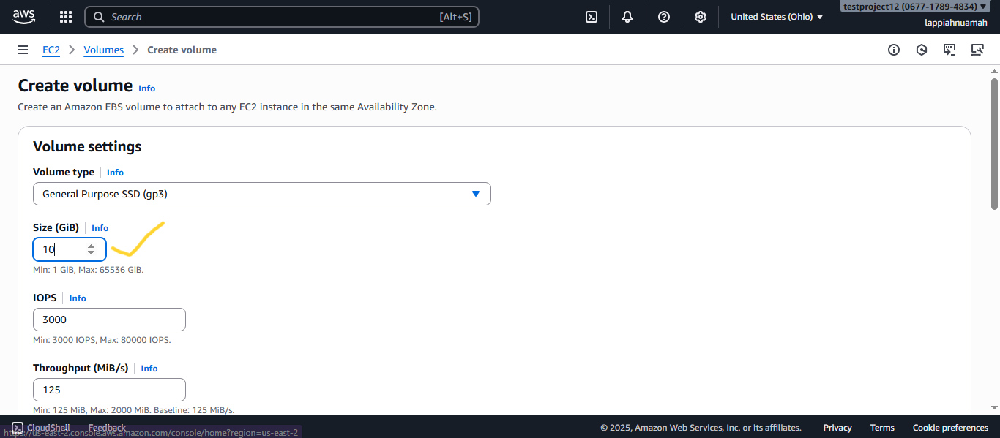
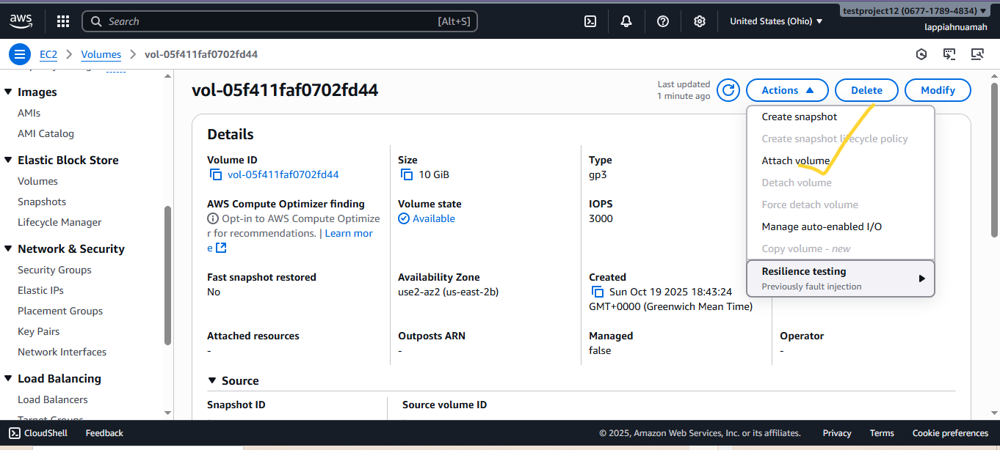
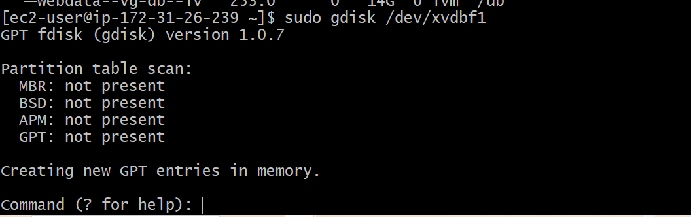
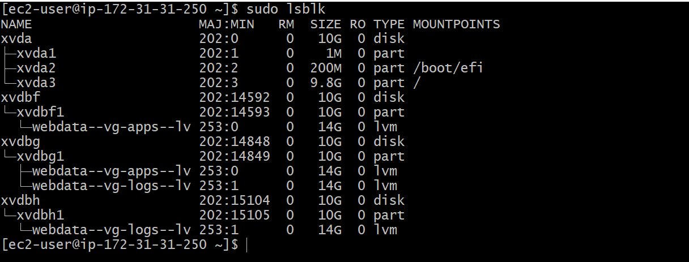
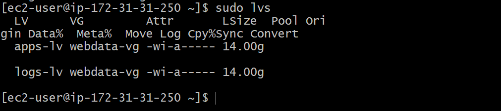

# DevOps Tooling Website Solution

This guide walks you through setting up three stateless web servers that share a common database and access to the same files using Network File System (NFS) as a shared file storage. 

---
Here's an architecture of the project. 
<br></br>

---

## 1. Project Architecture
The **DevOps Tooling Website** solution consist of:
- **Infrastructure** – AWS
- **Webserver Linux** – Red Hat Enterprise Linux 9
- **Database Server** – RHEL9 24.04 + MySQL
- **Storage Server** – Red Hat Enterprise Linux 9 + NFS Server
- **Programming Language** – PHP
- **Code Repository** – GitHub


## 2. Prepare NFS Server
- Spin up a new EC2 instance with RHEL9 Operating System.
- Configure LVM on the Server. If you have forgotten how to setup an instance click on the link below: 👇👇
- **Project 1: [Deploy a Complete LAMP Stack on AWS](https://github.com/lappiahnuamah/DevOps-CloudEngr-StegHub/tree/main/1.LAMP_Stack)** 
---
- After create a redhat ec2 instance, create 3 volumes in the same `Availability Zone (AZ)` as your web server each of size `10 GB`
- This is how to create a volume and attach to an ec2 instance. Click on Volumes on your left
---

---
- Click on `Create Volume`
---

---
- Make the size `10GB`
---

---
- Make the `Availability Zone` the same as your web server. For example in our case `us-east-2b`. Then click on create volume.
---

---
- Open the volume you created to attach to a webserver. Then click on `Actions`.
---

---
- Click on `Attach Volume` from the drop down.
---

---
- Choose the instance you want to attach the volume to and  the device name as well.
NB: Create 3 volumes for the webserver and 3 volume for the MySQL server, each of sizer 10GB and attach respectively.
---

---
- Scroll down and Click on `Attach Volume`
---

---

## 3. Configurations

Open the bash terminal. Use `lsblk` commmand to inspect what block devices are attached to the server you are on. NB: All devices in linux are in `/dev/` directory.
```bash
sudo lsblk
```
---

---
Enter `df -h` to see all mounts and free space on the server
```bash
df -h
```
---

---
Enter `gdisk` to create a partition on each of the 3 disks
```bash
sudo gdisk /dev/xvdbf
```
---

---

---
Use `lsblk` utility to view newly configured partition on each of the 3 disks
```bash
lsblk
``` 
---

---
Install `lvm2` with
```bash
sudo yum install lvm2
``` 
Check partitions using `lvm2` with
```bash
lvmdiskscan
``` 
Use `pvcreate` to mark each of the 3 disks as physical volumes
```bash
sudo pvcreate /dev/xvdbf1
sudo pvcreate /dev/xvdbg1
sudo pvcreate /dev/xvdbh1
``` 
Verify created `Volumes` 
```bash
sudo pvs
``` 
---

---
Now let's add all the 3 PVs to a volume group (VG). We will use the `vgcreate`. We will name our VG as `webdata-vg`. You can name the database volume group as `dbdata-vg` if you want. 
```bash
sudo vgcreate webdata-vg /dev/xvdbh1 /dev/xvdbg1  /dev/xvdbf1
``` 
Verify created `Volume Group` 
```bash
sudo vgs
``` 
---

---
Now let's create 2 logical volumes called `apps-lv` (Half of the PV size) and `logs-lv` (The other half).
NB: `apps-lv` is used to store data for the website. and `logs-lv` is used to store data for logs. The command we can use is `lvcreate`
```bash
sudo lvcreate -n apps-lv -L 14G webdata-vg
sudo lvcreate -n logs-lv -L 14G webdata-vg
``` 
Verify created `Logical Volumes` 
```bash
sudo lvs
``` 
---

---
Verify the entire setup
```bash
sudo vgdisplay -v
``` 
---

---
Use `mkfs` to format the logical volumes with `xfs`filesystem.
```bash
sudo mkfs -t xfs /dev/webdata-vg/lv-apps
sudo mkfs -t xfs /dev/webdata-vg/lv-opt
sudo mkfs -t xfs /dev/webdata-vg/lv-opt
``` 
---
Create `/var/www/html` directory to store website files.
```bash
sudo mkdir -p /var/www/html
``` 
Create `/home/recovery/logs` directory to backup of log data.
```bash
sudo mkdir -p /home/recovery/logs
``` 
- Mount  `lv-apps` on `/mnt/apps` to be used by webservers.
- Mount  `lv-logs` on `/mnt/logs` to be used by webservers logs
- Mount  `lv-opt` on `/mnt/opt` to be used by Jenkins Server

```bash
sudo mount /dev/webdata-vg/lv-apps /mnt/apps
sudo mount /dev/webdata-vg/lv-logs /mnt/logs
sudo mount /dev/webdata-vg/lv-opt /mnt/opt
```
---

---
- Install `NFS server`, configure it to start on reboot and make sure it is up and running.
```bash
sudo yum -y update
sudo yum install nfs-utils -y
sudo systemctl start nfs-server.service
sudo systemctl enable nfs-server.service
sudo systemctl status nfs-server.service
```
---

---
- Export the mounts for `webservers' subnet cidr` to connect as `clients`. Make sure to install all three webservers in the same subnet. 
- To check your `subnet cidr`. Open the EC2 details in the `AWS Web console` and locate `Networking` tab and open the subnet link.
---

---

---

---
- Make sure you setup permission to allow your webservers to read, write an execute files on NFS:
```bash
sudo chown -R apache: /mnt/apps
sudo chown -R nobody: /mnt/logs
sudo chown -R nobody: /mnt/opt


sudo chmod -R 777: /mnt/apps
sudo chmod -R 777: /mnt/logs
sudo chmod -R 777: /mnt/opt

sudo systemctl restart nfs-server.service
```
- Configure access to NFS for clients within the same subnet (`Subnet CIDR-172.31.16.0/20`)
```bash
sudo vi /etc/exports


/mnt/apps <Subnet-CIDR> (rw,sync,no_all_squash,no_root_squash)
/mnt/logs <Subnet-CIDR> (rw,sync,no_all_squash,no_root_squash)
/mnt/opt <Subnet-CIDR> (rw,sync,no_all_squash,no_root_squash)
```
Press the  `Esc` key then `:wq!`
```bash
sudo  exports -arv
```
---

---
Check which port is used by `NFS` and open it using Security Groups
```bash
rpcinfo -p | grep nfs
```
---

---
- `Important note:` Take note that for NFS server to be accessile from your client, make sure these ports are open: `TCP 111, UDP 111, UDP 2049`
---

---

---
## 4. Configure the Database Server

Launch a RedHat EC2 instance or a Ubuntu EC2 Server. <br></br>
Install MySQL
```bash
sudo yum update
sudo yum install mysql-server
```
Verify MySQL 
```bash
sudo systemctl restart mysqld
sudo systemctl enable mysqld
```
Create a database and name it `tooling`
```bash
sudo mysqld
CREATE DATABASE tooling;
```
Create a database user and name it`webaccess`
```bash
CREATE USER `webaccess`@`172.31.17.0/20` IDENTIFIED BY 'mypass123!';
```
Grant permission to `webaccess` user on `tooling` database from the webserver subnet cidr.
```bash
GRANT ALL ON tooling.* TO 'webaccess'@'172.31.17.0/20';
FLUSH PRIVILEGES;
SHOW DATABASES;
exit
```
---

---
Check users on your mysql server.
```sql
select User, Host FROM mysql.user;
```
---

---
---
## 5. Prepare the Web Servers

- Prepare the Web Servers to serve the same content from shared storage solutions `NFS Server` and `MySQL database`. Utilize NFS and mount the created Logical Volume `lv-apps` to the folder where the Apache stores files to be served to the users `(/var/www)`.
- Configure NFS client on all three servers.Install NFS Client with this: 

```bash
sudo yum install nfs-utils nfs4-acl-tools -y
```
- Mount `/var/www/` and target the NFS server's exports for apps
```bash
sudo mkdir /var/www
sudo mount -t nfs -o rw,nosuid <NFS-Server-Private-IP-Address>:/mnt/apps /var/www
```
- Verify that NFS was mounted successfuly by running `df -h` 
---

---
- Make sure that the changes will persist on Web Server after reboot:
```bash
sudo vi /etc/fstab
```
Add the following line
```bash
<NFS-Server-Private-IP-Address>:/mnt/apps /var/www nfs  defaults  0  0
```
### 6. Install `Remi's Repository`, Apache and PHP
```bash
sudo yum install httpd -y

sudo dnf install https://dl.fedoraproject.org/pub/epel/epel-release-latest-9.noarch.rpm

sudo dnf install dnf-utils http://rpms.remirepo.net/enterprise/remi-release-9.rpm

sudo dnf module reset php

sudo dnf module enable php:remi-7.4

sudo dnf install php php-opcache php-gd php-curl php-cli php-mysqlnd

sudo systemctl start php-fpm

sudo systemctl enable php-fpm

sudo setsebool -P httpd_execmem 1
```
- NB: Verify that `Apache` files and directories are available on the Web Server in `/var/www` and also on the NFS Server in `/mnt/apps`. If you see same files, it means that NFS is mounted correctly. 
- Locate the log folder for Apache on the Web Server and mount it to NFS server's export for logs. Then make sure the mount point will persist after reboot.
- If you're unsure of the location of the log files. Do this
```bash
sudo apachectl -V | grep SERVER_CONFIG_FILE
```
- Then run this:
```bash
sudo grep -i log /etc/httpd/conf/httpd.conf

```
- You will see directives like:
```nginx
ErrorLog "logs/error_log"
CustomLog "logs/access_log" combined
```
- Fork the tooling source code here 👇👇👇 and clone it. 
- **Tooling Soure code: [Tooling Website](https://github.com/StegTechHub/tooling)** 
- Deploy the tooling website's code to the Webserver. Ensure that the `html` folder from the repository is deployed to `/var/www/html`
- Here is what you should get when you deploy the tooling website on just one server. You should see on all three. 
---

---
### 7. Troubleshooting skills
Edit the config file:
```bash
sudo vi /var/www/html/functions.php
```
Then update this part:
```php
$db = mysqli_connect('<DB-Server-Private-IP-Address>', '<DB-USER>', '<DB-password>', '<DATABASE>');
```
Save and exit (`:wq`)
---
Incase you don't know who to find your private IP of your DB Server. You can check if from the AWS Console. The Details Section of the DB instance or On the DB EC2 instance, run
```bash
hostname -I
```
Make sure your MySQL server allows remote connections
- On the DB server, edit the configuration file (for Amazon Linux/RHEL)
```bash
sudo vi /etc/my.cnf
```
or 
```bash
sudo vi /etc/mysql/mysql.conf.d/mysqld.cnf
```
Find the line
```ini
bind-address = 127.0.0.1
```
and change it to 
```ini
bind-address = 0.0.0.0
```
Save and restart MySQL:
```bash
sudo systemctl restart mysqld
```
Stop your instances after you are done. 